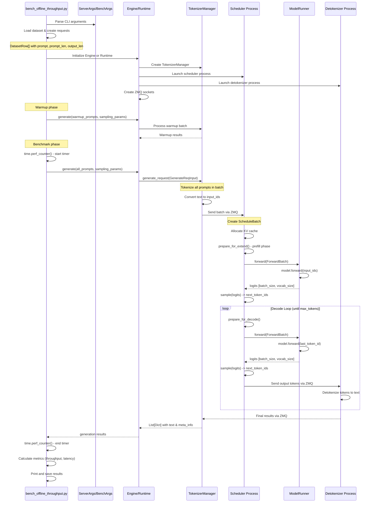

# bench_offline_throughput.py - Offline Throughput Benchmark

## Purpose

Measures **maximum throughput** in offline mode by submitting all requests at once and processing them as a single large batch. This benchmark tests the engine's ability to process a static workload without network overhead.

**File:** [python/sglang/bench_offline_throughput.py](../../python/sglang/bench_offline_throughput.py)

## Usage

```bash
# ShareGPT dataset
python -m sglang.bench_offline_throughput \
    --model-path meta-llama/Meta-Llama-3.1-8B-Instruct \
    --num-prompts 10

# Random dataset
python -m sglang.bench_offline_throughput \
    --model-path meta-llama/Meta-Llama-3.1-8B-Instruct \
    --dataset-name random \
    --random-input 1024 \
    --random-output 1024
```

## Execution Flow



## Code Walkthrough

### 1. Entry Point and Argument Parsing

```python
# bench_offline_throughput.py:440-473
if __name__ == "__main__":
    parser = argparse.ArgumentParser()
    ServerArgs.add_cli_args(parser)  # Model path, tp_size, mem_fraction, etc.
    BenchArgs.add_cli_args(parser)   # Dataset, num_prompts, output_len, etc.
    args = parser.parse_args()

    server_args = ServerArgs.from_cli_args(args)
    bench_args = BenchArgs.from_cli_args(args)
```

**Data Types:**
- `ServerArgs` - Configuration for model loading (model_path, tp_size, device, etc.)
- `BenchArgs` - Benchmark configuration (dataset_name, num_prompts, output_len, etc.)

### 2. Backend Initialization

```python
# bench_offline_throughput.py:334-341
def throughput_test(server_args: ServerArgs, bench_args: BenchArgs):
    if bench_args.backend == "engine":
        backend = Engine(**dataclasses.asdict(server_args))
        # Engine launches 3 processes:
        # 1. TokenizerManager (main process)
        # 2. Scheduler (subprocess)
        # 3. DetokenizerManager (subprocess)
    elif bench_args.backend == "runtime":
        backend = Runtime(**dataclasses.asdict(server_args))
        # Runtime is a lightweight HTTP client wrapper
```

**Engine Initialization Flow:**

```python
# srt/entrypoints/engine.py:107-136
class Engine(EngineBase):
    def __init__(self, **kwargs):
        server_args = ServerArgs(**kwargs)

        # Launch subprocesses
        tokenizer_manager, template_manager, scheduler_info, port_args = \
            _launch_subprocesses(server_args=server_args)

        # Create ZMQ sockets for IPC
        context = zmq.Context(2)
        self.send_to_rpc = get_zmq_socket(
            context, zmq.DEALER, port_args.rpc_ipc_name, True
        )
```

**Data Transformation:**
```
ServerArgs (kwargs)
    ↓
Engine instance
    ↓ launches
3 processes: TokenizerManager, Scheduler, DetokenizerManager
    ↓ creates
ZMQ sockets for IPC
```

### 3. Dataset Loading

```python
# bench_offline_throughput.py:357
input_requests = get_dataset(bench_args, tokenizer)
```

**get_dataset implementation:**

```python
# bench_serving.py (shared utility)
@dataclass
class DatasetRow:
    prompt: str          # Input text
    prompt_len: int      # Number of input tokens
    output_len: int      # Expected output length
    image_data: Optional[List[str]] = None

def get_dataset(args, tokenizer) -> List[DatasetRow]:
    if args.dataset_name == "sharegpt":
        # Load real conversation data
        dataset_path = args.dataset_path or download_sharegpt_dataset()
        with open(dataset_path) as f:
            dataset = json.load(f)
        dataset = [row for row in dataset if len(row["conversations"]) >= 2]

        # Convert to prompts
        requests = []
        for row in dataset[:args.num_prompts]:
            prompt = row["conversations"][0]["value"]
            prompt_len = len(tokenizer.encode(prompt))
            output_len = args.sharegpt_output_len or \
                        len(tokenizer.encode(row["conversations"][1]["value"]))
            requests.append(DatasetRow(prompt, prompt_len, output_len))

    elif args.dataset_name == "random":
        requests = sample_random_requests(
            input_len=args.random_input_len,
            output_len=args.random_output_len,
            num_prompts=args.num_prompts,
            tokenizer=tokenizer
        )

    return requests
```

**Data Transformation:**
```
Raw dataset file
    ↓ load & parse
List of conversation dicts
    ↓ filter & convert
List[DatasetRow]
    - prompt: str
    - prompt_len: int
    - output_len: int
```

### 4. Request Generation

```python
# bench_offline_throughput.py:232-241
def throughput_test_once(backend, reqs: List[DatasetRow], ...):
    prompt = [r.prompt for r in reqs]  # List[str]
    sampling_params = [
        {
            "temperature": 0,
            "max_new_tokens": r.output_len,
            "ignore_eos": ignore_eos,
            **extra_request_body,
        }
        for r in reqs
    ]  # List[Dict]
```

**Data Transformation:**
```
List[DatasetRow]
    ↓ extract
List[str] prompts + List[Dict] sampling_params
    ↓ combine
Ready for backend.generate()
```

### 5. Core Generation Call

```python
# bench_offline_throughput.py:250-257
st = time.perf_counter()
gen_out = backend.generate(
    prompt=prompt,                    # List[str]
    sampling_params=sampling_params,  # List[Dict]
    return_logprob=return_logprob,
    logprob_start_len=logprob_start_len,
)
latency = time.perf_counter() - st
```

**Engine.generate() implementation:**

```python
# srt/entrypoints/engine.py:163-243
class Engine:
    def generate(
        self,
        prompt: Union[List[str], str],
        sampling_params: Union[List[Dict], Dict],
        ...
    ) -> Union[Dict, Iterator[Dict]]:
        # Create request object
        obj = GenerateReqInput(
            text=prompt,
            input_ids=input_ids,
            sampling_params=sampling_params,
            ...
        )

        # Send to TokenizerManager
        generator = self.tokenizer_manager.generate_request(obj, None)

        # Wait for completion (non-streaming)
        if not stream:
            ret = self.loop.run_until_complete(generator.__anext__())
            return ret
```

**Data Transformation:**
```
List[str] prompts + List[Dict] params
    ↓ wrap
GenerateReqInput object
    ↓ send to
TokenizerManager.generate_request()
    ↓ async processing
List[Dict] results
    - text: generated text
    - meta_info: {prompt_tokens, completion_tokens, ...}
```

### 6. TokenizerManager Processing

```python
# srt/managers/tokenizer_manager.py (simplified flow)
class TokenizerManager:
    async def generate_request(
        self,
        obj: GenerateReqInput,
        request
    ) -> AsyncGenerator[Dict]:
        # Tokenize inputs
        input_ids = self.tokenize(obj.text)

        # Create internal request objects
        reqs = []
        for i, (prompt, params) in enumerate(zip(input_ids, obj.sampling_params)):
            req = Req(
                rid=uuid.uuid4().hex,
                origin_input_text=obj.text[i],
                origin_input_ids=prompt,
                sampling_params=SamplingParams(**params),
            )
            reqs.append(req)

        # Send to scheduler via ZMQ
        self.send_to_scheduler(reqs)

        # Wait for results from detokenizer
        results = await self.receive_from_detokenizer(reqs)

        yield results
```

**Data Transformation:**
```
GenerateReqInput
    ↓ tokenize
List[List[int]] input_ids  # [batch_size, seq_len]
    ↓ create Req objects
List[Req]
    - rid: unique ID
    - origin_input_ids: List[int]
    - sampling_params: SamplingParams
    ↓ serialize & send via ZMQ
Scheduler receives requests
```

### 7. Scheduler Processing

```python
# srt/managers/scheduler.py (simplified)
class Scheduler:
    def event_loop(self):
        while True:
            # Receive requests from TokenizerManager
            new_requests = self.recv_requests()

            # Add to waiting queue
            self.waiting_queue.extend(new_requests)

            # Schedule batch
            batch = self.get_next_batch_to_run()

            if batch.is_empty():
                continue

            # Execute forward pass
            if batch.forward_mode == ForwardMode.EXTEND:
                # Prefill: process input tokens
                self.run_batch_prefill(batch)
            else:
                # Decode: generate one token at a time
                self.run_batch_decode(batch)

    def run_batch_prefill(self, batch: ScheduleBatch):
        # Allocate KV cache
        batch.prepare_for_extend()

        # Create forward batch
        model_worker_batch = batch.get_model_worker_batch()
        forward_batch = ForwardBatch.init_new(model_worker_batch, self.model_runner)

        # Execute model forward
        logits_output, _ = self.model_runner.forward(forward_batch)

        # Sample next tokens
        next_token_ids = self.model_runner.sample(logits_output, forward_batch)

        # Update batch state
        batch.output_ids = next_token_ids
```

**Data Transformation in Prefill:**
```
List[Req] requests
    ↓ create batch
ScheduleBatch
    - reqs: List[Req]
    - req_to_token_pool: token allocation
    ↓ prepare
ForwardBatch
    - input_ids: Tensor[total_tokens]  # concatenated
    - req_pool_indices: Tensor[batch_size]
    - seq_lens: Tensor[batch_size]
    ↓ forward pass
logits: Tensor[batch_size, vocab_size]
    ↓ sample
next_token_ids: Tensor[batch_size]
```

### 8. ModelRunner Forward Pass

```python
# srt/model_executor/model_runner.py (simplified)
class ModelRunner:
    def forward(self, forward_batch: ForwardBatch):
        # Prepare input metadata
        input_metadata = self.prepare_input_metadata(forward_batch)

        # Model forward
        if forward_batch.forward_mode == ForwardMode.EXTEND:
            # Prefill: process all input tokens
            logits = self.model.forward(
                input_ids=forward_batch.input_ids,      # [total_tokens]
                positions=forward_batch.positions,       # [total_tokens]
                input_metadata=input_metadata,
            )
        else:
            # Decode: process one token per request
            logits = self.model.forward(
                input_ids=forward_batch.input_ids,      # [batch_size]
                positions=forward_batch.positions,       # [batch_size]
                input_metadata=input_metadata,
            )

        return LogitsProcessorOutput(
            next_token_logits=logits,  # [batch_size, vocab_size]
        ), None

    def sample(self, logits_output, forward_batch):
        # Apply temperature, top_p, top_k
        probs = self.apply_sampling_params(
            logits_output.next_token_logits,
            forward_batch.sampling_params
        )

        # Sample next tokens
        next_token_ids = torch.multinomial(probs, num_samples=1)

        return next_token_ids  # [batch_size]
```

**Tensor Shapes in Forward Pass:**

**Prefill Phase:**
```
input_ids: [total_tokens] where total_tokens = sum(seq_lens)
    Example: batch=2, seq_lens=[10, 15] -> input_ids=[25]
    ↓ model forward
logits: [total_tokens, vocab_size]
    ↓ extract last token per sequence
next_token_logits: [batch_size, vocab_size]
    ↓ sample
next_token_ids: [batch_size]
```

**Decode Phase:**
```
input_ids: [batch_size] - one token per request
    ↓ model forward
logits: [batch_size, vocab_size]
    ↓ sample
next_token_ids: [batch_size]
```

### 9. Decoding Loop

```python
# srt/managers/scheduler.py
def run_batch_decode(self, batch: ScheduleBatch):
    # Update input with previous output tokens
    batch.prepare_for_decode()

    # Forward pass
    model_worker_batch = batch.get_model_worker_batch()
    forward_batch = ForwardBatch.init_new(model_worker_batch, self.model_runner)
    logits_output, _ = self.model_runner.forward(forward_batch)

    # Sample next tokens
    next_token_ids = self.model_runner.sample(logits_output, forward_batch)

    # Send to detokenizer
    self.send_to_detokenizer(batch, next_token_ids)

    # Check for finished requests
    finished_reqs = [
        req for req in batch.reqs
        if req.finished or len(req.output_ids) >= req.sampling_params.max_new_tokens
    ]

    # Remove finished from batch
    batch.filter_finished(finished_reqs)
```

**Decoding Loop Data Flow:**
```
Initial state after prefill:
    batch.output_ids = [first_token] for each request

Loop iteration 1:
    input: [first_token] -> forward -> sample -> [second_token]

Loop iteration 2:
    input: [second_token] -> forward -> sample -> [third_token]

... continues until max_new_tokens or EOS
```

### 10. Detokenization

```python
# srt/managers/detokenizer_manager.py
class DetokenizerManager:
    def event_loop(self):
        while True:
            # Receive token IDs from scheduler
            recv_obj = self.recv_from_scheduler()

            for req_id, token_id in recv_obj.items():
                # Accumulate tokens
                self.token_buffer[req_id].append(token_id)

                # Detokenize
                text = self.tokenizer.decode(
                    self.token_buffer[req_id],
                    skip_special_tokens=True
                )

                # Check if request finished
                if self.is_finished(req_id):
                    # Send final result to TokenizerManager
                    self.send_to_tokenizer({
                        "rid": req_id,
                        "text": text,
                        "meta_info": {
                            "prompt_tokens": len(input_ids),
                            "completion_tokens": len(self.token_buffer[req_id]),
                            "finish_reason": "length" or "stop"
                        }
                    })
```

**Data Transformation:**
```
Token IDs from scheduler
    [101, 2023, 2003, 1037, 3231]
    ↓ accumulate in buffer
    ↓ tokenizer.decode()
Text output
    "This is a test"
    ↓ wrap with metadata
Final result dict
    {
        "text": "This is a test",
        "meta_info": {
            "prompt_tokens": 10,
            "completion_tokens": 5,
            "finish_reason": "length"
        }
    }
```

### 11. Result Collection and Metrics

```python
# bench_offline_throughput.py:270-295
measurement_results = {
    "backend": backend_name,
    "successful_requests": len(reqs),
    "total_latency": latency,
    "total_input_tokens": sum(r.prompt_len for r in reqs),
    "total_output_tokens": sum(
        o["meta_info"]["completion_tokens"] for o in gen_out
    ),
}

# Calculate throughput metrics
measurement_results["request_throughput"] = len(reqs) / latency
measurement_results["input_throughput"] = (
    measurement_results["total_input_tokens"] / latency
)
measurement_results["output_throughput"] = (
    measurement_results["total_output_tokens"] / latency
)
measurement_results["total_throughput"] = (
    measurement_results["total_input_tokens"] +
    measurement_results["total_output_tokens"]
) / latency

# Get internal server stats
server_info = backend.get_server_info()
measurement_results["last_gen_throughput"] = \
    server_info["internal_states"][0]["last_gen_throughput"]
```

**Final Output Metrics:**
```
{
    "backend": "engine",
    "successful_requests": 1000,
    "total_latency": 45.23,  # seconds
    "total_input_tokens": 512000,
    "total_output_tokens": 256000,
    "request_throughput": 22.11,  # req/s
    "input_throughput": 11320.61,  # tok/s
    "output_throughput": 5659.48,  # tok/s
    "total_throughput": 16980.09,  # tok/s
    "last_gen_throughput": 5670.23  # tok/s (from scheduler)
}
```

## Key Data Structures

### DatasetRow
```python
@dataclass
class DatasetRow:
    prompt: str          # "What is the capital of France?"
    prompt_len: int      # 7
    output_len: int      # 20
    image_data: Optional[List[str]] = None
```

### GenerateReqInput
```python
@dataclass
class GenerateReqInput:
    text: Union[List[str], str]              # Input prompts
    input_ids: Optional[List[List[int]]]     # Or pre-tokenized
    sampling_params: Union[List[Dict], Dict]  # Generation params
    return_logprob: bool = False
    logprob_start_len: int = -1
    stream: bool = False
```

### Req (Internal Request Object)
```python
class Req:
    rid: str                        # Unique request ID
    origin_input_text: str          # Original prompt
    origin_input_ids: List[int]     # Tokenized input
    sampling_params: SamplingParams  # Temperature, top_p, etc.
    output_ids: List[int] = []      # Generated tokens
    finished: bool = False
```

### ScheduleBatch
```python
class ScheduleBatch:
    reqs: List[Req]                 # Requests in batch
    req_pool_indices: torch.Tensor  # [batch_size]
    seq_lens: torch.Tensor          # [batch_size]
    prefix_lens: torch.Tensor       # [batch_size]
    forward_mode: ForwardMode       # EXTEND or DECODE

    # KV cache allocation
    req_to_token_pool: ReqToTokenPool
    token_to_kv_pool: KVPool
```

### ForwardBatch
```python
class ForwardBatch:
    input_ids: torch.Tensor         # [total_tokens] or [batch_size]
    positions: torch.Tensor         # Position IDs
    req_pool_indices: torch.Tensor  # [batch_size]
    seq_lens: torch.Tensor          # [batch_size]
    forward_mode: ForwardMode       # EXTEND or DECODE
```

## Complete Data Flow Example

**Input:**
```python
prompts = [
    "What is the capital of France?",
    "Explain quantum computing"
]
sampling_params = [
    {"temperature": 0, "max_new_tokens": 20},
    {"temperature": 0, "max_new_tokens": 30}
]
```

**Step-by-step transformation:**

1. **Tokenization:**
```python
input_ids = [
    [1, 1841, 338, 278, 7483, 310, 3444, 29973],      # 8 tokens
    [1, 9544, 7420, 12346, 20602]                      # 5 tokens
]
```

2. **Create Requests:**
```python
reqs = [
    Req(rid="abc123", origin_input_ids=input_ids[0], ...),
    Req(rid="def456", origin_input_ids=input_ids[1], ...)
]
```

3. **Prefill Batch:**
```python
# Concatenate inputs
forward_batch.input_ids = [1, 1841, 338, ..., 1, 9544, 7420, ...]  # 13 tokens
forward_batch.seq_lens = [8, 5]

# Forward pass
logits = model.forward(input_ids)  # [13, vocab_size]

# Extract last token logits
next_token_logits = [logits[7], logits[12]]  # [2, vocab_size]

# Sample
next_token_ids = [15043, 27120]  # "Paris", "Quantum"
```

4. **Decode Loop (Iteration 1):**
```python
# Input is previous output
forward_batch.input_ids = [15043, 27120]  # [2]
forward_batch.seq_lens = [9, 6]  # Updated lengths

# Forward
logits = model.forward(input_ids)  # [2, vocab_size]

# Sample
next_token_ids = [338, 338]  # "is", "is"
```

5. **Final Output:**
```python
[
    {
        "text": "Paris is the capital and largest city of France.",
        "meta_info": {
            "prompt_tokens": 8,
            "completion_tokens": 20,
            "finish_reason": "length"
        }
    },
    {
        "text": "Quantum computing is a type of computing that uses...",
        "meta_info": {
            "prompt_tokens": 5,
            "completion_tokens": 30,
            "finish_reason": "length"
        }
    }
]
```

## Performance Characteristics

- **Throughput:** Maximized by batching all requests together
- **Latency:** Higher per-request latency due to batch processing
- **Memory:** Requires enough GPU memory for entire batch KV cache
- **Use Case:** Offline batch inference, benchmark maximum throughput

## Key Files Reference

- [bench_offline_throughput.py](../../python/sglang/bench_offline_throughput.py) - Main benchmark script
- [engine.py](../../python/sglang/srt/entrypoints/engine.py) - Offline inference entry point
- [tokenizer_manager.py](../../python/sglang/srt/managers/tokenizer_manager.py) - Request tokenization
- [scheduler.py](../../python/sglang/srt/managers/scheduler.py) - Batch scheduling and execution
- [model_runner.py](../../python/sglang/srt/model_executor/model_runner.py) - Model forward passes
- [detokenizer_manager.py](../../python/sglang/srt/managers/detokenizer_manager.py) - Token to text conversion
- [io_struct.py](../../python/sglang/srt/managers/io_struct.py) - Request/response data structures
