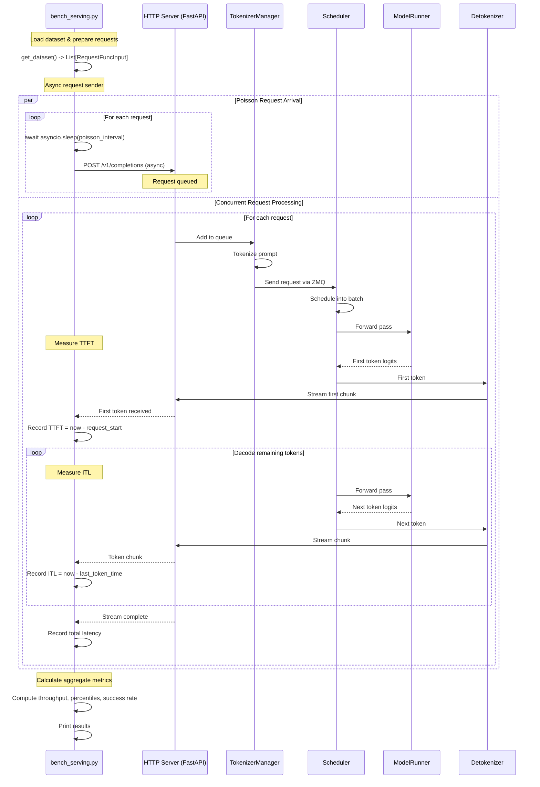

# bench_serving.py - Online Serving Benchmark with Dynamic Request Arrival

## Purpose

Benchmarks **online serving performance** with **dynamic request arrival patterns**. This simulates real-world production scenarios where requests arrive over time (Poisson process), measuring Time To First Token (TTFT), Inter-Token Latency (ITL), and throughput under load.

**File:** [python/sglang/bench_serving.py](../../python/sglang/bench_serving.py)

## Usage

```bash
# Basic usage with running server
python3 -m sglang.bench_serving \
    --backend sglang \
    --base-url http://localhost:30000 \
    --num-prompts 100

# Random dataset with request rate control
python3 -m sglang.bench_serving \
    --backend sglang \
    --base-url http://localhost:30000 \
    --dataset-name random \
    --num-prompts 3000 \
    --random-input 1024 \
    --random-output 1024 \
    --request-rate 10  # 10 requests/second

# ShareGPT dataset
python3 -m sglang.bench_serving \
    --backend sglang \
    --base-url http://localhost:30000 \
    --dataset-name sharegpt \
    --num-prompts 1000
```

## Key Differences from Other Benchmarks

| Aspect | bench_serving.py | bench_offline_throughput.py |
|--------|-----------------|---------------------------|
| **Request Pattern** | Poisson arrival (dynamic) | All at once (static) |
| **Server** | HTTP server required | Optional (Engine/Runtime) |
| **Streaming** | Supports streaming | Non-streaming |
| **Metrics** | TTFT, ITL, per-request latency | Overall throughput |
| **Use Case** | Production serving | Batch processing |

## Execution Flow



## Code Walkthrough

### 1. Request Input Preparation

```python
# bench_serving.py:72-82
@dataclass
class RequestFuncInput:
    prompt: str                      # Input text or token IDs
    api_url: str                     # HTTP endpoint
    prompt_len: int                  # Number of input tokens
    output_len: int                  # Expected output length
    model: str                       # Model name
    lora_name: str                   # LoRA adapter (optional)
    image_data: Optional[List[str]]  # Image URLs/data
    extra_request_body: Dict[str, Any]  # Additional params
    timestamp: Optional[float] = None    # Request arrival time
```

### 2. Dataset Loading

```python
# Similar to bench_offline_throughput but returns RequestFuncInput
def get_dataset(args) -> List[RequestFuncInput]:
    if args.dataset_name == "sharegpt":
        dataset = load_sharegpt_dataset(args.dataset_path)

        requests = []
        for row in dataset[:args.num_prompts]:
            prompt = row["conversations"][0]["value"]
            prompt_len = len(tokenizer.encode(prompt))
            output_len = args.sharegpt_output_len or \
                        len(tokenizer.encode(row["conversations"][1]["value"]))

            requests.append(RequestFuncInput(
                prompt=prompt,
                api_url=args.base_url + args.endpoint,
                prompt_len=prompt_len,
                output_len=output_len,
                model=args.model,
                lora_name=args.lora_name,
                image_data=None,
                extra_request_body={}
            ))

    elif args.dataset_name == "random":
        requests = sample_random_requests(
            input_len=args.random_input_len,
            output_len=args.random_output_len,
            num_prompts=args.num_prompts,
            tokenizer=tokenizer
        )

    return requests
```

**Data Transformation:**
```
Dataset file
    ↓ load
List[Dict] conversations
    ↓ process
List[RequestFuncInput]
    - prompt: str
    - prompt_len: int
    - output_len: int
    - api_url: str
    - timestamp: float (added later)
```

### 3. Request Arrival Pattern

```python
# Main benchmark function
async def benchmark(
    backend: str,
    api_url: str,
    input_requests: List[RequestFuncInput],
    request_rate: float,
    ...
):
    # Add timestamps for Poisson arrival
    if request_rate == float("inf"):
        # Send all requests immediately
        for req in input_requests:
            req.timestamp = 0
    else:
        # Poisson arrival: random intervals with given rate
        for i, req in enumerate(input_requests):
            # Inter-arrival time ~ Exponential(request_rate)
            req.timestamp = np.random.exponential(1.0 / request_rate)

    # Sort by timestamp
    input_requests.sort(key=lambda x: x.timestamp)

    # Track progress
    pbar = tqdm(total=len(input_requests), desc="Requests")

    # Launch async tasks
    async with create_aiohttp_session() as session:
        tasks = []
        for req in input_requests:
            # Schedule task with delay
            task = asyncio.create_task(
                send_request_with_delay(
                    backend,
                    req,
                    pbar,
                    session
                )
            )
            tasks.append(task)

        # Wait for all requests to complete
        outputs = await asyncio.gather(*tasks)

    return outputs
```

**Request Timing Example:**
```python
# request_rate = 10 req/s
# Expected interval = 1/10 = 0.1 seconds

timestamps = [
    0.0,      # Request 0
    0.087,    # Request 1 (random exponential)
    0.213,    # Request 2
    0.301,    # Request 3
    ...
]

# Actual sending:
# t=0.000s: sleep(0.0s), send request 0
# t=0.087s: sleep(0.087s), send request 1
# t=0.213s: sleep(0.126s), send request 2
# ...
```

### 4. Async Request Sending

```python
async def send_request_with_delay(
    backend: str,
    request_input: RequestFuncInput,
    pbar: tqdm,
    session: aiohttp.ClientSession
):
    # Wait until scheduled time
    await asyncio.sleep(request_input.timestamp)

    # Send request based on backend
    if backend == "sglang":
        output = await async_request_openai_completions(
            request_input,
            pbar
        )
    elif backend == "vllm":
        output = await async_request_openai_completions(
            request_input,
            pbar
        )
    # ... other backends

    return output
```

### 5. Streaming Request Handler

```python
# bench_serving.py:194-288
async def async_request_openai_completions(
    request_func_input: RequestFuncInput,
    pbar: Optional[tqdm] = None,
) -> RequestFuncOutput:
    api_url = request_func_input.api_url
    prompt = request_func_input.prompt

    async with _create_bench_client_session() as session:
        # Prepare payload
        payload = {
            "model": request_func_input.model,
            "prompt": prompt,
            "temperature": 0.0,
            "max_tokens": request_func_input.output_len,
            "stream": True,  # Enable streaming
            "ignore_eos": True,
        }

        output = RequestFuncOutput.init_new(request_func_input)

        generated_text = ""
        ttft = 0.0
        st = time.perf_counter()
        most_recent_timestamp = st

        try:
            async with session.post(
                url=api_url,
                json=payload,
                headers=get_auth_headers()
            ) as response:
                if response.status == 200:
                    # Stream response chunks
                    async for chunk_bytes in response.content:
                        chunk_bytes = chunk_bytes.strip()
                        if not chunk_bytes:
                            continue

                        # Parse SSE format: "data: {...}"
                        chunk = remove_prefix(chunk_bytes.decode("utf-8"), "data: ")
                        if chunk == "[DONE]":
                            break

                        data = json.loads(chunk)

                        if data["choices"][0]["text"]:
                            timestamp = time.perf_counter()

                            # First token
                            if ttft == 0.0:
                                ttft = timestamp - st
                                output.ttft = ttft

                            # Subsequent tokens
                            else:
                                # Inter-token latency
                                output.itl.append(timestamp - most_recent_timestamp)
                                output.text_chunks.append(data["choices"][0]["text"])

                            most_recent_timestamp = timestamp
                            generated_text += data["choices"][0]["text"]

                    output.generated_text = generated_text
                    output.success = True
                    output.latency = time.perf_counter() - st
                    output.output_len = len(output.text_chunks) + 1  # +1 for first token

                else:
                    output.error = response.reason or ""
                    output.success = False

        except Exception:
            output.success = False
            exc_info = sys.exc_info()
            output.error = "".join(traceback.format_exception(*exc_info))

        if pbar:
            pbar.update(1)

        return output
```

**Data Transformation:**

```python
# HTTP Response (Server-Sent Events format):
"""
data: {"choices": [{"text": "The"}], "model": "..."}

data: {"choices": [{"text": " capital"}], "model": "..."}

data: {"choices": [{"text": " of"}], "model": "..."}

...

data: [DONE]
"""

# Parsed output:
RequestFuncOutput(
    generated_text="The capital of France is Paris.",
    success=True,
    latency=2.345,  # Total time
    ttft=0.234,     # Time to first token
    itl=[0.012, 0.011, 0.013, ...],  # Inter-token latencies
    text_chunks=["The", " capital", " of", " France", ...],
    prompt_len=7,
    output_len=6
)
```

### 6. Metrics Calculation

```python
# bench_serving.py (main benchmark function)
def calculate_metrics(
    outputs: List[RequestFuncOutput],
    dur_s: float,
    tokenizer: PreTrainedTokenizer
) -> BenchmarkMetrics:
    # Filter successful requests
    actual_output_lens = [
        output.output_len for output in outputs if output.success
    ]
    total_input = sum(output.prompt_len for output in outputs if output.success)
    total_output = sum(actual_output_lens)
    total_requests = len([output for output in outputs if output.success])

    # Calculate throughput
    request_throughput = total_requests / dur_s
    input_throughput = total_input / dur_s
    output_throughput = total_output / dur_s
    total_throughput = (total_input + total_output) / dur_s

    # TTFT percentiles
    ttfts = [output.ttft for output in outputs if output.success]
    mean_ttft = np.mean(ttfts)
    median_ttft = np.median(ttfts)
    p99_ttft = np.percentile(ttfts, 99)

    # ITL percentiles (flatten all ITLs)
    itls = []
    for output in outputs:
        if output.success:
            itls.extend(output.itl)
    mean_itl = np.mean(itls)
    median_itl = np.median(itls)
    p99_itl = np.percentile(itls, 99)

    # Latency percentiles
    latencies = [output.latency for output in outputs if output.success]
    mean_latency = np.mean(latencies)
    median_latency = np.median(latencies)
    p99_latency = np.percentile(latencies, 99)

    return BenchmarkMetrics(
        completed=total_requests,
        total_input=total_input,
        total_output=total_output,
        request_throughput=request_throughput,
        input_throughput=input_throughput,
        output_throughput=output_throughput,
        total_throughput=total_throughput,
        mean_ttft=mean_ttft,
        median_ttft=median_ttft,
        p99_ttft=p99_ttft,
        mean_itl=mean_itl,
        median_itl=median_itl,
        p99_itl=p99_itl,
        mean_latency=mean_latency,
        median_latency=median_latency,
        p99_latency=p99_latency,
    )
```

**Example Metrics Output:**
```
============ Serving Benchmark Result ============
Successful requests:                     1000
Benchmark duration (s):                  125.3
Total input tokens:                      512000
Total generated tokens:                  256000
Request throughput (req/s):              7.98
Input token throughput (tok/s):          4086.9
Output token throughput (tok/s):         2043.4
Total token throughput (tok/s):          6130.3
------------------- Latency --------------------
Mean TTFT (ms):                          234.5
Median TTFT (ms):                        189.2
P99 TTFT (ms):                           876.4
Mean ITL (ms):                           12.3
Median ITL (ms):                         11.8
P99 ITL (ms):                            28.7
Mean E2E latency (s):                    3.45
Median E2E latency (s):                  2.89
P99 E2E latency (s):                     8.12
==================================================
```

### 7. Server-Side Processing

While the benchmark client is external to the server, here's what happens on the server side:

```python
# srt/entrypoints/http_server.py (simplified)
from fastapi import FastAPI, Request
from fastapi.responses import StreamingResponse

app = FastAPI()

@app.post("/v1/completions")
async def completions(request: Request):
    # Parse request body
    body = await request.json()

    # Create GenerateReqInput
    gen_input = GenerateReqInput(
        text=body["prompt"],
        sampling_params=body.get("sampling_params", {}),
        stream=body.get("stream", False),
    )

    # Send to engine
    if body.get("stream", False):
        # Streaming response
        async def generate_stream():
            async for chunk in engine.async_generate(**vars(gen_input)):
                # Format as SSE
                yield f"data: {json.dumps(chunk)}\n\n"
            yield "data: [DONE]\n\n"

        return StreamingResponse(
            generate_stream(),
            media_type="text/event-stream"
        )
    else:
        # Non-streaming response
        result = await engine.async_generate(**vars(gen_input))
        return result
```

**Request Flow Through Server:**

```
HTTP Request
    ↓ FastAPI endpoint
GenerateReqInput
    ↓ Engine.async_generate()
TokenizerManager.generate_request()
    ↓ tokenize
Req objects
    ↓ ZMQ
Scheduler (subprocess)
    ↓ batch & forward
ModelRunner.forward()
    ↓ sample
Output tokens
    ↓ ZMQ
DetokenizerManager (subprocess)
    ↓ detokenize
Text chunks
    ↓ ZMQ
TokenizerManager
    ↓ async yield
FastAPI StreamingResponse
    ↓ SSE format
HTTP Client (benchmark)
```

## Request Output Data Structure

```python
@dataclass
class RequestFuncOutput:
    generated_text: str = ""
    success: bool = False
    latency: float = 0.0        # Total end-to-end latency
    ttft: float = 0.0           # Time to first token
    itl: List[float] = []       # Inter-token latencies [t1-t0, t2-t1, ...]
    text_chunks: List[str] = [] # Token texts ["The", " capital", ...]
    prompt_len: int = 0
    error: str = ""
    output_len: int = 0
```

**Example Timeline:**
```
Request sent at t=0.000s

t=0.234s: First token "The" received
    ttft = 0.234s

t=0.246s: Second token " capital" received
    itl[0] = 0.246 - 0.234 = 0.012s

t=0.257s: Third token " of" received
    itl[1] = 0.257 - 0.246 = 0.011s

...

t=2.345s: Last token received
    latency = 2.345s
    output_len = 6
```

## Backend Support

The benchmark supports multiple backends:

```python
# bench_serving.py
ASYNC_REQUEST_FUNCS = {
    "sglang": async_request_openai_completions,
    "vllm": async_request_openai_completions,
    "lmdeploy": async_request_openai_completions,
    "trt-llm": async_request_trt_llm,
    "openai": async_request_openai_chat_completions,
    "anthropic": async_request_anthropic,
    "gemini": async_request_gemini,
    "vertex-ai": async_request_vertex,
}
```

Each backend may have different API formats, but all return `RequestFuncOutput` for consistent metrics.

## Advanced Features

### 1. Poisson vs Burst Traffic

```python
# Poisson arrival (realistic production)
--request-rate 10  # 10 req/s average, random intervals

# Burst (stress test)
--request-rate inf  # Send all requests immediately
```

### 2. Image Input Support

```python
# bench_serving.py
@dataclass
class RequestFuncInput:
    image_data: Optional[List[str]] = None  # Image URLs or base64

# In request:
payload = {
    "prompt": "Describe this image",
    "image_data": ["data:image/png;base64,iVBORw0KG..."],
    "max_tokens": 100
}
```

### 3. Custom Sampling Parameters

```python
--extra-request-body '{"temperature": 0.8, "top_p": 0.95, "top_k": 50}'
```

### 4. Prefix Caching

```python
# Generate dataset with shared prefixes
--dataset-name generated-shared-prefix \
--gsp-num-groups 64 \
--gsp-prompts-per-group 16 \
--gsp-system-prompt-len 2048
```

## Performance Analysis

### TTFT (Time To First Token)
- Measures **prefill latency** + queuing delay
- Lower is better for user experience
- Affected by: input length, queue depth, batch size

### ITL (Inter-Token Latency)
- Measures **decode latency** per token
- Lower is better for streaming quality
- Affected by: batch size, model size, decode efficiency

### Throughput
- Measures total tokens processed per second
- Higher is better for efficiency
- Tradeoff: Higher batch size → higher throughput, higher latency

## Key Files Reference

- [bench_serving.py](../../python/sglang/bench_serving.py) - Main benchmark script
- [http_server.py](../../python/sglang/srt/entrypoints/http_server.py) - FastAPI server
- [engine.py](../../python/sglang/srt/entrypoints/engine.py) - Engine with async support
- [tokenizer_manager.py](../../python/sglang/srt/managers/tokenizer_manager.py) - Async request handling
- [scheduler.py](../../python/sglang/srt/managers/scheduler.py) - Batching and scheduling

## Comparison with bench_offline_throughput

| Metric | bench_serving.py | bench_offline_throughput.py |
|--------|-----------------|---------------------------|
| **TTFT** | ✓ Measured per request | ✗ Not applicable |
| **ITL** | ✓ Per-token latency | ✗ Not measured |
| **Throughput** | ✓ Under load | ✓ Maximum possible |
| **Latency** | ✓ Per-request E2E | ✓ Total batch time |
| **Queuing** | ✓ Simulated | ✗ No queuing |
| **Streaming** | ✓ Supported | ✗ Batch only |
