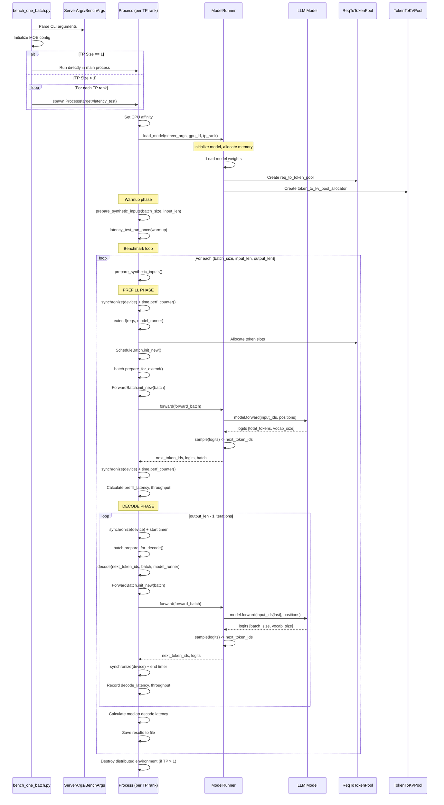

# bench_one_batch.py - Low-Level Single Batch Latency Benchmark

## Purpose

Measures **single batch latency** using low-level APIs **without launching an HTTP server**. This benchmark directly uses the `ModelRunner` class to execute prefill and decode operations, providing the most granular performance measurements.

**File:** [python/sglang/bench_one_batch.py](../../python/sglang/bench_one_batch.py)

## Usage

```bash
# Latency test with dummy weights
python -m sglang.bench_one_batch \
    --model-path meta-llama/Meta-Llama-3-8B-Instruct \
    --load-format dummy

# Sweep multiple configurations
python -m sglang.bench_one_batch \
    --model-path meta-llama/Meta-Llama-3-8B-Instruct \
    --batch-size 1 12 14 \
    --input-len 256 512 \
    --output-len 32 256 \
    --run-name test_run

# With profiling
python -m sglang.bench_one_batch \
    --model-path meta-llama/Meta-Llama-3-8B-Instruct \
    --batch-size 1 \
    --input-len 256 \
    --profile

# Correctness test
python -m sglang.bench_one_batch \
    --model-path TinyLlama/TinyLlama-1.1B-Chat-v0.4 \
    --correctness-test
```

## Key Differences from Other Benchmarks

| Aspect | bench_one_batch.py | bench_offline_throughput.py |
|--------|-------------------|---------------------------|
| **Level** | Low-level ModelRunner API | High-level Engine API |
| **HTTP Server** | No server | No server |
| **Processes** | Multi-process (TP) | Multi-process (full stack) |
| **Measurement** | Per-stage latency | End-to-end throughput |
| **Use Case** | Profiling, debugging | Throughput benchmarking |

## Execution Flow



## Code Walkthrough

### 1. Entry Point and Configuration

```python
# bench_one_batch.py:778-795
if __name__ == "__main__":
    parser = argparse.ArgumentParser()
    ServerArgs.add_cli_args(parser)
    BenchArgs.add_cli_args(parser)
    args = parser.parse_args()

    server_args = ServerArgs.from_cli_args(args)
    bench_args = BenchArgs.from_cli_args(args)

    try:
        main(server_args, bench_args)
    finally:
        if server_args.tp_size != 1:
            kill_process_tree(os.getpid(), include_parent=False)
```

**BenchArgs Configuration:**
```python
@dataclasses.dataclass
class BenchArgs:
    run_name: str = "default"
    batch_size: Tuple[int] = (1,)      # Can sweep multiple values
    input_len: Tuple[int] = (1024,)    # Input sequence lengths
    output_len: Tuple[int] = (16,)     # Output sequence lengths
    correctness_test: bool = False      # Run correctness vs latency
    profile: bool = False               # Enable torch profiler
    profile_activities: Tuple[str] = ("CPU", "GPU")
    profile_stage: str = "all"          # "all", "prefill", "decode"
```

### 2. Process Spawning for Tensor Parallelism

```python
# bench_one_batch.py:735-776
def main(server_args, bench_args):
    server_args.cuda_graph_max_bs = max(bench_args.batch_size)
    _set_envs_and_config(server_args)

    port_args = PortArgs.init_new(server_args)

    if server_args.tp_size == 1:
        # Single GPU: run directly
        work_func(server_args, port_args, bench_args, gpu_id=0, tp_rank=0)
    else:
        # Multi-GPU: spawn process per TP rank
        workers = []
        for tp_rank in range(server_args.tp_size):
            with maybe_reindex_device_id(tp_rank) as gpu_id:
                proc = multiprocessing.Process(
                    target=work_func,
                    args=(server_args, port_args, bench_args, gpu_id, tp_rank),
                )
                proc.start()
                workers.append(proc)

        for proc in workers:
            proc.join()
```

**Process Architecture:**
```
Main Process
    ↓ spawns (if tp_size > 1)
Process 0 (GPU 0, TP rank 0)
Process 1 (GPU 1, TP rank 1)
...
Process N (GPU N, TP rank N)
    ↓ each loads
1/N of model weights (tensor parallel slices)
```

### 3. Model Loading

```python
# bench_one_batch.py:245-272
def load_model(server_args, port_args, gpu_id, tp_rank):
    suppress_other_loggers()
    rank_print = print if tp_rank == 0 else lambda *args, **kwargs: None
    moe_ep_rank = tp_rank // (server_args.tp_size // server_args.ep_size)

    # Create model config
    model_config = ModelConfig.from_server_args(server_args)

    # Initialize ModelRunner
    model_runner = ModelRunner(
        model_config=model_config,
        mem_fraction_static=server_args.mem_fraction_static,
        gpu_id=gpu_id,
        tp_rank=tp_rank,
        tp_size=server_args.tp_size,
        moe_ep_rank=moe_ep_rank,
        moe_ep_size=server_args.ep_size,
        pp_rank=0,
        pp_size=1,
        nccl_port=port_args.nccl_port,
        server_args=server_args,
    )

    rank_print(f"max_total_num_tokens={model_runner.max_total_num_tokens}")

    # Load tokenizer
    tokenizer = get_tokenizer(
        server_args.tokenizer_path,
        tokenizer_mode=server_args.tokenizer_mode,
        trust_remote_code=server_args.trust_remote_code,
    )

    if server_args.tp_size > 1:
        dist.barrier()  # Synchronize all ranks

    return model_runner, tokenizer
```

**ModelRunner Initialization:**

```python
# srt/model_executor/model_runner.py (simplified)
class ModelRunner:
    def __init__(
        self,
        model_config,
        mem_fraction_static,
        gpu_id,
        tp_rank,
        tp_size,
        ...
    ):
        self.gpu_id = gpu_id
        self.tp_rank = tp_rank
        self.tp_size = tp_size
        self.device = torch.device(f"cuda:{gpu_id}")

        # Load model
        self.model = load_model(
            model_config,
            tp_rank=tp_rank,
            tp_size=tp_size,
        )

        # Allocate KV cache
        self.max_total_num_tokens = self.profile_max_num_tokens(
            mem_fraction_static
        )

        # Create memory pools
        self.req_to_token_pool = ReqToTokenPool(
            size=self.max_total_num_tokens,
            max_context_len=model_config.context_len,
        )
        self.token_to_kv_pool_allocator = TokenToKVPoolAllocator(
            size=self.max_total_num_tokens,
            num_layers=model_config.num_layers,
            num_heads=model_config.num_heads,
            head_dim=model_config.head_dim,
            device=self.device,
        )
```

**Memory Allocation:**
```
GPU Memory Layout:
├── Model Weights (sharded across TP ranks)
├── KV Cache Pool
│   ├── Token Pool (indices: 0 to max_total_num_tokens)
│   └── KV Pool (actual key/value tensors)
└── Activation Memory (temporary)
```

### 4. Synthetic Input Generation

```python
# bench_one_batch.py:324-350
def prepare_synthetic_inputs_for_latency_test(
    batch_size,
    input_len,
    custom_inputs=None
):
    # Generate random token IDs
    input_ids = (
        custom_inputs
        if custom_inputs
        else np.random.randint(0, 10000, (batch_size, input_len), dtype=np.int32)
    )

    # Create sampling params
    sampling_params = SamplingParams(
        temperature=0,
        max_new_tokens=BenchArgs.output_len,
    )

    # Create Req objects (internal request representation)
    reqs = []
    for i in range(len(input_ids)):
        req = Req(
            rid=i,                              # Request ID
            origin_input_text="",               # Empty (no text)
            origin_input_ids=list(input_ids[i]),  # Token IDs
            sampling_params=sampling_params,
        )
        req.fill_ids = req.origin_input_ids    # IDs to process
        req.extend_input_len = len(req.fill_ids)  # Length to extend
        req.logprob_start_len = len(req.origin_input_ids) - 1
        reqs.append(req)

    return reqs
```

**Data Structure:**
```python
reqs = [
    Req(
        rid=0,
        origin_input_ids=[4523, 1245, ..., 8901],  # input_len tokens
        fill_ids=[4523, 1245, ..., 8901],
        extend_input_len=input_len,
        sampling_params=SamplingParams(temperature=0, max_new_tokens=16)
    ),
    # ... batch_size requests total
]
```

### 5. Prefill Phase (Extend)

```python
# bench_one_batch.py:353-377
@torch.no_grad
def extend(reqs, model_runner):
    # Create dummy tree_cache (no prefix caching in benchmark)
    dummy_tree_cache = SimpleNamespace(
        page_size=model_runner.server_args.page_size,
        device=model_runner.device,
        token_to_kv_pool_allocator=model_runner.token_to_kv_pool_allocator,
    )

    # Create ScheduleBatch
    batch = ScheduleBatch.init_new(
        reqs=reqs,
        req_to_token_pool=model_runner.req_to_token_pool,
        token_to_kv_pool_allocator=model_runner.token_to_kv_pool_allocator,
        tree_cache=dummy_tree_cache,
        model_config=model_runner.model_config,
        enable_overlap=False,
        spec_algorithm=SpeculativeAlgorithm.NONE,
    )

    # Prepare batch for prefill
    batch.prepare_for_extend()

    # Create ForwardBatch
    model_worker_batch = batch.get_model_worker_batch()
    forward_batch = ForwardBatch.init_new(model_worker_batch, model_runner)

    # Execute forward pass
    logits_output, _ = model_runner.forward(forward_batch)

    # Sample next tokens
    next_token_ids = model_runner.sample(logits_output, forward_batch)

    return next_token_ids, logits_output.next_token_logits, batch
```

**ScheduleBatch.prepare_for_extend():**

```python
# srt/managers/schedule_batch.py
class ScheduleBatch:
    def prepare_for_extend(self):
        """Prepare batch for prefill phase"""
        self.forward_mode = ForwardMode.EXTEND

        # Allocate KV cache slots
        for req in self.reqs:
            # Allocate tokens in pool
            token_indices = self.req_to_token_pool.alloc(
                req.extend_input_len
            )
            req.token_indices = token_indices

        # Build input tensor (concatenate all requests)
        self.input_ids = torch.cat([
            torch.tensor(req.fill_ids, device=self.device)
            for req in self.reqs
        ])  # [total_tokens]

        # Track sequence lengths
        self.seq_lens = torch.tensor(
            [req.extend_input_len for req in self.reqs],
            device=self.device
        )  # [batch_size]

        # Track cumulative lengths for indexing
        self.cum_lens = torch.cumsum(
            torch.tensor([0] + self.seq_lens.tolist()[:-1]),
            dim=0
        )  # [batch_size]
```

**Data Transformation in Prefill:**

```python
# Input: 2 requests with different lengths
reqs = [
    Req(rid=0, fill_ids=[101, 2023, 2003, 1037, 3231, 1012]),     # len=6
    Req(rid=1, fill_ids=[101, 7592, 2088])                        # len=3
]

# After prepare_for_extend():
batch.input_ids = [101, 2023, 2003, 1037, 3231, 1012, 101, 7592, 2088]  # [9]
batch.seq_lens = [6, 3]                                                   # [2]
batch.cum_lens = [0, 6]                                                   # [2]

# Forward batch
forward_batch.input_ids = [101, 2023, 2003, 1037, 3231, 1012, 101, 7592, 2088]
forward_batch.positions = [0, 1, 2, 3, 4, 5, 0, 1, 2]  # Position IDs

# Model forward
logits = model.forward(input_ids, positions)  # [9, vocab_size]

# Extract last token logits for each request
next_token_logits = [
    logits[5],   # Last token of first request
    logits[8]    # Last token of second request
]  # [2, vocab_size]

# Sample
next_token_ids = [2003, 1012]  # [2]
```

### 6. Decode Phase

```python
# bench_one_batch.py:380-389
@torch.no_grad
def decode(input_token_ids, batch, model_runner):
    # Update batch with previous output
    batch.output_ids = input_token_ids

    # Prepare for decode
    batch.prepare_for_decode()

    # Create forward batch
    model_worker_batch = batch.get_model_worker_batch()
    forward_batch = ForwardBatch.init_new(model_worker_batch, model_runner)

    # Forward pass
    logits_output, _ = model_runner.forward(forward_batch)

    # Sample next tokens
    next_token_ids = model_runner.sample(logits_output, forward_batch)

    return next_token_ids, logits_output.next_token_logits
```

**ScheduleBatch.prepare_for_decode():**

```python
# srt/managers/schedule_batch.py
class ScheduleBatch:
    def prepare_for_decode(self):
        """Prepare batch for decode phase"""
        self.forward_mode = ForwardMode.DECODE

        # Allocate one more token slot per request
        for req in self.reqs:
            new_token_idx = self.req_to_token_pool.alloc(1)
            req.token_indices.append(new_token_idx)

        # Input is last output token for each request
        self.input_ids = torch.tensor(
            self.output_ids,
            device=self.device
        )  # [batch_size]

        # Update sequence lengths
        for req in self.reqs:
            req.seq_len += 1

        self.seq_lens = torch.tensor(
            [req.seq_len for req in self.reqs],
            device=self.device
        )  # [batch_size]
```

**Decode Data Flow:**

```python
# Initial state after prefill
batch.output_ids = [2003, 1012]  # First generated tokens
batch.seq_lens = [6, 3]          # Original lengths

# Iteration 1: prepare_for_decode()
batch.input_ids = [2003, 1012]   # [2] - last output becomes input
batch.positions = [6, 3]         # Next position for each sequence
batch.seq_lens = [7, 4]          # Updated lengths

# Forward
logits = model.forward([2003, 1012], positions=[6, 3])  # [2, vocab_size]

# Sample
next_token_ids = [1037, 2088]  # [2]

# Iteration 2
batch.input_ids = [1037, 2088]
batch.positions = [7, 4]
batch.seq_lens = [8, 5]
# ... continues
```

### 7. Latency Measurement

```python
# bench_one_batch.py:496-623
def latency_test_run_once(
    run_name,
    model_runner,
    rank_print,
    reqs,
    batch_size,
    input_len,
    output_len,
    device,
    ...
):
    # Clear memory pools
    model_runner.req_to_token_pool.clear()
    model_runner.token_to_kv_pool_allocator.clear()

    measurement_results = {
        "run_name": run_name,
        "batch_size": batch_size,
        "input_len": input_len,
        "output_len": output_len,
    }

    # PREFILL MEASUREMENT
    synchronize(device)  # Ensure all GPU ops complete
    tic = time.perf_counter()

    next_token_ids, _, batch = extend(reqs, model_runner)

    synchronize(device)
    prefill_latency = time.perf_counter() - tic

    prefill_throughput = input_len * batch_size / prefill_latency
    rank_print(
        f"Prefill. latency: {prefill_latency:6.5f} s, "
        f"throughput: {prefill_throughput:9.2f} token/s"
    )
    measurement_results["prefill_latency"] = prefill_latency
    measurement_results["prefill_throughput"] = prefill_throughput

    # DECODE MEASUREMENTS
    decode_latencies = []
    for i in range(output_len - 1):
        synchronize(device)
        tic = time.perf_counter()

        next_token_ids, _ = decode(next_token_ids, batch, model_runner)

        synchronize(device)
        latency = time.perf_counter() - tic

        decode_throughput = batch_size / latency
        decode_latencies.append(latency)

        if i < 5:  # Print first few iterations
            rank_print(
                f"Decode {i}. Batch size: {batch_size}, "
                f"latency: {latency:6.5f} s, "
                f"throughput: {decode_throughput:9.2f} token/s"
            )

    # Calculate median decode latency
    med_decode_latency = np.median(decode_latencies)
    med_decode_throughput = batch_size / med_decode_latency

    rank_print(
        f"Decode. median latency: {med_decode_latency:6.5f} s, "
        f"median throughput: {med_decode_throughput:9.2f} token/s"
    )

    measurement_results["median_decode_latency"] = med_decode_latency
    measurement_results["median_decode_throughput"] = med_decode_throughput

    # Total metrics
    tot_latency = prefill_latency + sum(decode_latencies)
    overall_throughput = (input_len + output_len) * batch_size / tot_latency

    rank_print(
        f"Total. latency: {tot_latency:6.3f} s, "
        f"throughput: {overall_throughput:9.2f} token/s"
    )

    measurement_results["total_latency"] = tot_latency
    measurement_results["overall_throughput"] = overall_throughput

    return measurement_results
```

**Synchronization Importance:**

```python
# GPU operations are asynchronous by default
# Must synchronize before timing to ensure accurate measurements

# Without synchronization:
tic = time.perf_counter()
model.forward(x)  # Returns immediately (queued on GPU)
toc = time.perf_counter()  # Measures queue time, not execution time!

# With synchronization:
synchronize(device)  # Wait for all previous ops
tic = time.perf_counter()
model.forward(x)
synchronize(device)  # Wait for forward to complete
toc = time.perf_counter()  # Accurate execution time
```

### 8. Profiling Support

```python
# bench_one_batch.py:533-558
if enable_profile_prefill:
    profiler = start_profile(
        profile_activities,
        profile_record_shapes=profile_record_shapes,
        rank_print=rank_print,
    )

synchronize(device)
tic = time.perf_counter()
next_token_ids, _, batch = extend(reqs, model_runner)
synchronize(device)
prefill_latency = time.perf_counter() - tic

if enable_profile_prefill:
    trace_filename = _create_torch_profiler_filename(
        profile_filename_prefix, batch_size, input_len, output_len, "prefill"
    )
    stop_profile(
        profiler,
        profile_activities,
        rank_print=rank_print,
        save_trace=True,
        trace_filename=trace_filename,
        stage="prefill",
    )
```

**Profiler Activities:**

```python
# CPU + GPU profiling
profile_activities = [
    torch.profiler.ProfilerActivity.CPU,
    torch.profiler.ProfilerActivity.CUDA
]

# CUDA profiler (for nsys)
nsys profile \
    --force-overwrite=true \
    -o bench_one_batch \
    python -m sglang.bench_one_batch \
        --model-path meta-llama/Meta-Llama-3-8B-Instruct \
        --batch-size 1 \
        --input-len 256 \
        --profile \
        --profile-activities CUDA_PROFILER
```

### 9. Correctness Testing

```python
# bench_one_batch.py:443-489
def correctness_test(server_args, port_args, bench_args, gpu_id, tp_rank):
    model_runner, tokenizer = load_model(server_args, port_args, gpu_id, tp_rank)

    # Prepare test prompts
    prompts = [
        "The capital of France is",
        "The capital of the United Kindom is",
        "Today is a sunny day and I like",
    ]

    input_ids = [tokenizer.encode(p) for p in prompts]

    # Test 1: Prefill with partial input
    reqs = prepare_inputs_for_correctness_test(bench_args, tokenizer, prompts)
    next_token_ids, next_token_logits, batch = extend(reqs, model_runner)

    rank_print(f"prefill logits (first half): {next_token_logits}")

    # Test 2: Extend with remaining input
    reqs = prepare_extend_inputs_for_correctness_test(
        bench_args, input_ids, reqs, model_runner
    )
    next_token_ids, next_token_logits, batch = extend(reqs, model_runner)

    rank_print(f"prefill logits (final): {next_token_logits}")

    # Test 3: Decode multiple tokens
    output_ids = [input_ids[i] + [next_token_ids[i]] for i in range(len(input_ids))]

    for _ in range(bench_args.output_len[0] - 1):
        next_token_ids, _ = decode(next_token_ids, batch, model_runner)
        next_token_ids_list = next_token_ids.tolist()
        for i in range(len(reqs)):
            output_ids[i].append(next_token_ids_list[i])

    # Print decoded outputs
    for i in range(len(reqs)):
        rank_print(f"========== Prompt {i} ==========")
        rank_print(tokenizer.decode(output_ids[i]))
```

**Example Output:**
```
input_ids=[[1, 450, 7483, 310, 3444, 338], ...]

prefill logits (first half): tensor([[-10.0312,  -9.5000,   0.8931,  ...]])

prefill logits (final): tensor([[-8.3125, -7.1172,  3.3457,  ...]])

========== Prompt 0 ==========
<s> The capital of France is Paris.
The capital of the United States is Washington, D.C.

========== Prompt 1 ==========
<s> The capital of the United Kindom is London.
...
```

### 10. Configuration Sweep

```python
# bench_one_batch.py:679-724
# Run sweep across multiple configurations
result_list = []
for bs, il, ol in itertools.product(
    bench_args.batch_size,     # [1, 12, 14]
    bench_args.input_len,      # [256, 512]
    bench_args.output_len      # [32, 256]
):
    reqs = prepare_synthetic_inputs_for_latency_test(bs, il)
    ret = latency_test_run_once(
        bench_args.run_name,
        model_runner,
        rank_print,
        reqs,
        bs,
        il,
        ol,
        server_args.device,
        bench_args.log_decode_step,
        bench_args.profile if tp_rank == 0 else None,
        bench_args.profile_record_shapes,
        bench_args.profile_activities,
        bench_args.profile_filename_prefix,
        bench_args.profile_stage,
        tp_rank,
    )
    if ret is not None:
        result_list.append(ret)

# Save results
if tp_rank == 0 and bench_args.result_filename:
    with open(bench_args.result_filename, "a") as fout:
        for result in result_list:
            fout.write(json.dumps(result) + "\n")
```

**Output Format (JSONL):**
```json
{"run_name": "test", "batch_size": 1, "input_len": 256, "output_len": 32, "prefill_latency": 0.123, "prefill_throughput": 2080.5, "median_decode_latency": 0.0045, "median_decode_throughput": 222.2, "total_latency": 0.267, "overall_throughput": 1078.7}
{"run_name": "test", "batch_size": 1, "input_len": 256, "output_len": 256, "prefill_latency": 0.124, ...}
{"run_name": "test", "batch_size": 12, "input_len": 256, "output_len": 32, "prefill_latency": 0.145, ...}
...
```

## Key Data Structures

### Req (Request Object)
```python
class Req:
    rid: Union[str, int]        # Request ID
    origin_input_text: str      # Original prompt text (empty in benchmark)
    origin_input_ids: List[int] # Input token IDs
    fill_ids: List[int]         # IDs to fill in next extend
    sampling_params: SamplingParams
    output_ids: List[int] = []  # Generated tokens

    # Memory management
    token_indices: List[int]    # Allocated slots in token pool
    seq_len: int                # Current sequence length
    extend_input_len: int       # Length to extend in next prefill
```

### ScheduleBatch
```python
class ScheduleBatch:
    reqs: List[Req]
    forward_mode: ForwardMode   # EXTEND or DECODE

    # Input data
    input_ids: torch.Tensor     # [total_tokens] or [batch_size]
    seq_lens: torch.Tensor      # [batch_size]
    positions: torch.Tensor     # Position IDs

    # Memory pools
    req_to_token_pool: ReqToTokenPool
    token_to_kv_pool_allocator: TokenToKVPoolAllocator
```

### ForwardBatch
```python
class ForwardBatch:
    input_ids: torch.Tensor         # [total_tokens] or [batch_size]
    positions: torch.Tensor         # Position IDs
    req_pool_indices: torch.Tensor  # [batch_size]
    seq_lens: torch.Tensor          # [batch_size]
    forward_mode: ForwardMode

    # KV cache pointers
    req_to_token: torch.Tensor      # [batch_size, max_context_len]
    token_to_kv_pool: KVCache       # Actual KV tensors
```

## Tensor Shapes Summary

### Prefill Phase
```python
# Example: batch_size=2, input_lens=[256, 512]
batch.input_ids: [768]              # Concatenated
batch.seq_lens: [2] = [256, 512]
batch.positions: [768] = [0..255, 0..511]

# Model forward
logits: [768, vocab_size]

# Extract last token logits
next_token_logits: [2, vocab_size]

# Sample
next_token_ids: [2]
```

### Decode Phase
```python
# Example: batch_size=2, iteration 5
batch.input_ids: [2]                # Last token from each sequence
batch.seq_lens: [2] = [261, 517]    # Original + 5
batch.positions: [2] = [260, 516]   # Next position

# Model forward
logits: [2, vocab_size]

# Sample
next_token_ids: [2]
```

## Performance Metrics

**Example Output:**
```
Prefill. latency: 0.12345 s, throughput: 2074.68 token/s
Decode 0. Batch size: 1, latency: 0.00452 s, throughput: 221.24 token/s
Decode 1. Batch size: 1, latency: 0.00448 s, throughput: 223.21 token/s
Decode 2. Batch size: 1, latency: 0.00451 s, throughput: 221.73 token/s
...
Decode. median latency: 0.00450 s, median throughput: 222.22 token/s
Total. latency: 0.267 s, throughput: 1078.65 token/s
```

**Metrics Breakdown:**
- **Prefill Throughput:** `(batch_size × input_len) / prefill_latency` (tokens/s)
- **Decode Throughput:** `batch_size / decode_latency` (tokens/s)
- **Overall Throughput:** `(batch_size × (input_len + output_len)) / total_latency`

## Use Cases

1. **Latency Profiling:** Measure per-stage latency (prefill vs decode)
2. **Performance Debugging:** Identify bottlenecks with torch profiler
3. **Correctness Validation:** Verify model outputs match expected values
4. **Configuration Tuning:** Sweep batch sizes and sequence lengths
5. **Hardware Benchmarking:** Compare performance across GPUs

## Key Files Reference

- [bench_one_batch.py](../../python/sglang/bench_one_batch.py) - Main benchmark script
- [model_runner.py](../../python/sglang/srt/model_executor/model_runner.py) - Model execution
- [schedule_batch.py](../../python/sglang/srt/managers/schedule_batch.py) - Batch management
- [forward_batch_info.py](../../python/sglang/srt/model_executor/forward_batch_info.py) - Forward batch data
- [req_to_token_pool.py](../../python/sglang/srt/mem_cache/req_to_token_pool.py) - Token allocation
- [kv_cache.py](../../python/sglang/srt/layers/kv_cache.py) - KV cache implementation
