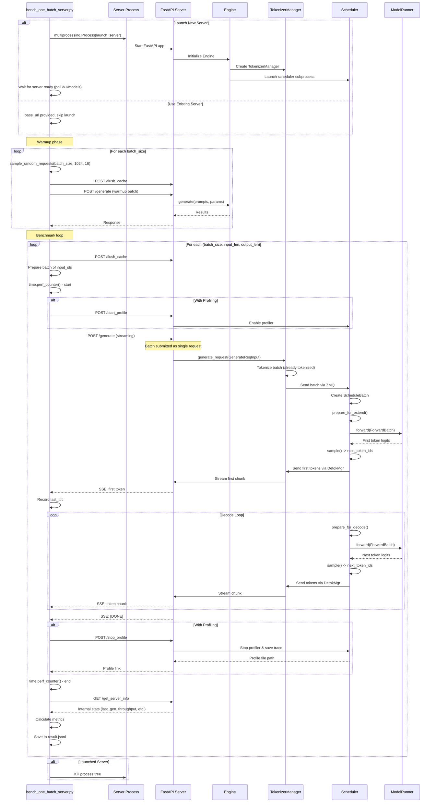

# bench_one_batch_server.py - Single Batch Latency via HTTP Server

## Purpose

Measures **single batch latency through the HTTP server interface**, combining the controlled batch sizes of `bench_one_batch.py` with the realistic HTTP overhead of `bench_serving.py`. Useful for profiling server performance and comparing HTTP vs direct API overhead.

**File:** [python/sglang/bench_one_batch_server.py](../../python/sglang/bench_one_batch_server.py)

## Usage

```bash
# Launch server and benchmark
python3 -m sglang.bench_one_batch_server \
    --model meta-llama/Meta-Llama-3.1-8B \
    --batch-size 1 16 64 \
    --input-len 1024 \
    --output-len 8

# Connect to existing server
python3 -m sglang.bench_one_batch_server \
    --model None \
    --base-url http://localhost:30000 \
    --batch-size 16 \
    --input-len 1024 \
    --output-len 8

# With profiling
python3 -m sglang.bench_one_batch_server \
    --model None \
    --base-url http://localhost:30000 \
    --batch-size 16 \
    --input-len 1024 \
    --output-len 8 \
    --profile \
    --profile-by-stage \
    --show-report
```

## Key Differences from Other Benchmarks

| Feature | bench_one_batch_server | bench_one_batch | bench_serving |
|---------|----------------------|-----------------|---------------|
| **Server** | ✓ HTTP required | ✗ Direct API | ✓ HTTP required |
| **Batch Control** | ✓ Fixed batch | ✓ Fixed batch | ✗ Dynamic |
| **Request Pattern** | All at once | N/A | Poisson arrival |
| **Profiling** | ✓ Server-side | ✓ Model-level | Limited |
| **Use Case** | Server profiling | Model profiling | Production sim |

## Execution Flow



## Code Walkthrough

### 1. Server Launch (Optional)

```python
# bench_one_batch_server.py:184-211
def launch_server_process(server_args: ServerArgs):
    # Launch server in subprocess
    proc = multiprocessing.Process(
        target=launch_server_internal,
        args=(server_args,)
    )
    proc.start()

    base_url = f"http://{server_args.host}:{server_args.port}"
    timeout = 600  # 10 minutes

    # Poll until server ready
    start_time = time.time()
    while time.time() - start_time < timeout:
        try:
            headers = {"Content-Type": "application/json; charset=utf-8"}
            response = requests.get(f"{base_url}/v1/models", headers=headers)
            if response.status_code == 200:
                return proc, base_url
        except requests.RequestException:
            pass
        time.sleep(10)

    raise TimeoutError("Server failed to start within timeout")
```

**Process Architecture:**
```
Main Process (benchmark script)
    ↓ spawns
Server Process
    ↓ launches
FastAPI HTTP Server
    ↓ initializes
Engine
    ↓ launches
Scheduler Process + Detokenizer Process
```

### 2. Input Preparation

```python
# bench_one_batch_server.py:234-256
def run_one_case(
    url: str,
    batch_size: int,
    input_len: int,
    output_len: int,
    tokenizer: PreTrainedTokenizer,
    dataset_name: str = "random",
    ...
):
    # Flush cache
    requests.post(url + "/flush_cache")

    # Generate inputs
    if dataset_name == "mmmu":
        # Vision-language model inputs
        input_requests = sample_mmmu_requests(
            num_requests=batch_size,
            processor=tokenizer,
            fixed_output_len=output_len,
        )
    elif dataset_name == "random":
        # Text-only inputs
        input_requests = sample_random_requests(
            input_len=input_len,
            output_len=output_len,
            num_prompts=batch_size,
            tokenizer=tokenizer,
            return_text=False,  # Return token IDs directly
        )

    # Extract input_ids
    input_ids = [req.prompt for req in input_requests]  # List[List[int]]
```

**Data Structure:**
```python
input_ids = [
    [1, 2345, 6789, ..., 1234],  # Request 0: input_len tokens
    [1, 8765, 4321, ..., 9876],  # Request 1: input_len tokens
    # ... batch_size requests
]
```

### 3. Request Payload

```python
# bench_one_batch_server.py:272-296
payload = {
    "input_ids": input_ids,  # List[List[int]] - pre-tokenized
    "sampling_params": {
        "temperature": temperature,
        "max_new_tokens": output_len,
        "ignore_eos": True,
        "stream_interval": stream_interval,  # How often to return chunks
    },
    "return_logprob": return_logprob,
    "stream": True,  # Enable streaming
}

# For vision models
if dataset_name == "mmmu":
    payload["image_data"] = [req.image_data for req in input_requests]
```

**Key Difference from bench_serving:**
- **bench_serving**: Sends multiple HTTP requests (one per prompt)
- **bench_one_batch_server**: Sends ONE HTTP request with batch of prompts

### 4. Profiling Integration

```python
# bench_one_batch_server.py:298-308
if profile:
    from sglang.profiler import run_profile

    profile_link = run_profile(
        url=url,
        num_steps=profile_steps,          # Number of forward steps to profile
        activities=["CPU", "GPU"],
        output_dir=profile_output_dir,
        profile_by_stage=profile_by_stage,  # Separate prefill/decode traces
        profile_prefix=profile_prefix,
    )
```

**run_profile implementation:**

```python
# python/sglang/profiler.py (simplified)
def run_profile(
    url: str,
    num_steps: int,
    activities: List[str],
    profile_by_stage: bool = False,
    ...
) -> str:
    # Start profiler on server
    requests.post(url + "/start_profile", json={
        "num_forward_steps": num_steps,
        "activities": activities,
        "profile_by_stage": profile_by_stage,
    })

    # Server starts torch.profiler in scheduler process

    # Wait for profiling to complete (done automatically during forward passes)

    # Stop profiler
    response = requests.post(url + "/stop_profile")
    result = response.json()

    # Returns path or URL to trace file
    return result["profile_path"]
```

**Profile Output:**
```
/tmp/sglang_profile/
├── profile_bs-16-il-1024_prefill.json.gz    # Prefill trace
├── profile_bs-16-il-1024_decode.json.gz     # Decode trace
└── profile_bs-16-il-1024_all.json.gz        # Combined trace
```

### 5. Streaming Response Handling

```python
# bench_one_batch_server.py:310-334
tic = time.perf_counter()

response = requests.post(
    url + "/generate",
    json=payload,
    stream=True,  # Important: receive chunks as they arrive
)

last_ttft = 0.0
for chunk in response.iter_lines(decode_unicode=False):
    chunk = chunk.decode("utf-8")

    if chunk and chunk.startswith("data:"):
        if chunk == "data: [DONE]":
            break

        # Parse JSON payload
        data = json.loads(chunk[5:].strip("\n"))

        if "error" in data:
            raise RuntimeError(f"Request failed: {data}")

        # Check for first token of last request in batch
        if data["meta_info"]["completion_tokens"] == 1:
            last_ttft = time.perf_counter() - tic

latency = time.perf_counter() - tic
```

**Streaming Data Format (Server-Sent Events):**
```
data: {"text": ["The", "Hello", ...], "meta_info": {"completion_tokens": 1, ...}}

data: {"text": ["The capital", "Hello world", ...], "meta_info": {"completion_tokens": 2, ...}}

...

data: [DONE]
```

**Note:** For batched requests, each SSE chunk contains outputs for ALL requests in the batch.

### 6. Metrics Calculation

```python
# bench_one_batch_server.py:336-360
# Compute metrics
latency = time.perf_counter() - tic

# Input throughput: tokens processed during TTFT
input_throughput = batch_size * input_len / last_ttft

# Output throughput: tokens generated during decode
output_throughput = batch_size * output_len / (latency - last_ttft)

# Overall throughput
overall_throughput = batch_size * (input_len + output_len) / latency

# Get server internal stats
server_info = requests.get(url + "/get_server_info").json()
internal_state = server_info.get("internal_states", [{}])
last_gen_throughput = internal_state[0].get("last_gen_throughput", -1)
acc_length = internal_state[0].get("avg_spec_accept_length", -1)  # For speculative decoding

# Create result object
result = BenchOneCaseResult(
    run_name=run_name,
    batch_size=batch_size,
    input_len=input_len,
    output_len=output_len,
    latency=latency,
    input_throughput=input_throughput,
    output_throughput=output_throughput,
    overall_throughput=overall_throughput,
    last_ttft=last_ttft,
    last_gen_throughput=last_gen_throughput,
    acc_length=acc_length,
    profile_link=profile_link,
)
```

**Example Metrics:**
```python
{
    "run_name": "test",
    "batch_size": 16,
    "input_len": 1024,
    "output_len": 256,
    "latency": 3.456,           # Total time
    "input_throughput": 4723.6, # 16 * 1024 / last_ttft
    "output_throughput": 1180.9, # 16 * 256 / (latency - last_ttft)
    "overall_throughput": 5904.5,
    "last_ttft": 0.234,         # Time to first token
    "last_gen_throughput": 1185.2,  # From scheduler
    "acc_length": 2.3           # Speculative decoding stats
}
```

### 7. Server Info Endpoint

```python
# Server side: srt/entrypoints/http_server.py
@app.get("/get_server_info")
async def get_server_info():
    # Query scheduler for internal stats
    scheduler_stats = await engine.get_server_info()

    return {
        "tokenizer_path": engine.tokenizer_manager.tokenizer_path,
        "model_path": engine.server_args.model_path,
        "internal_states": [
            {
                "last_gen_throughput": scheduler_stats["last_gen_throughput"],
                "avg_spec_accept_length": scheduler_stats.get("avg_spec_accept_length", 0),
                "memory_usage": {
                    "token_capacity": scheduler_stats["max_total_tokens"],
                    "used_tokens": scheduler_stats["current_tokens"],
                },
                # ... more stats
            }
        ]
    }
```

### 8. Configuration Sweep

```python
# bench_one_batch_server.py:447-591
def run_benchmark(server_args: ServerArgs, bench_args: BenchArgs):
    if bench_args.base_url:
        # Use existing server
        proc, base_url = None, bench_args.base_url
    else:
        # Launch new server
        proc, base_url = launch_server_process(server_args)

    # Get tokenizer from server
    server_info = requests.get(base_url + "/get_server_info").json()
    tokenizer_path = server_info["tokenizer_path"]
    tokenizer = get_tokenizer(tokenizer_path)

    # Warmup
    if not bench_args.skip_warmup:
        for bs in bench_args.batch_size:
            run_one_case(
                base_url,
                batch_size=bs,
                input_len=1024,
                output_len=16,
                tokenizer=tokenizer,
                ...
            )

    # Benchmark all configurations
    results = []
    for bs, il, ol in itertools.product(
        bench_args.batch_size,    # [1, 16, 64]
        bench_args.input_len,     # [1024, 2048]
        bench_args.output_len     # [8, 256]
    ):
        result = run_one_case(
            base_url,
            bs,
            il,
            ol,
            tokenizer=tokenizer,
            result_filename=bench_args.result_filename,
            ...
        )
        results.append(result)

    # Profile (separate pass with profiling enabled)
    if bench_args.profile:
        profile_results = []
        for bs, il, ol in itertools.product(...):
            profile_prefix = f"bs-{bs}-il-{il}"
            profile_result = run_one_case(
                base_url,
                bs,
                il,
                ol,
                tokenizer=tokenizer,
                profile=True,
                profile_steps=bench_args.profile_steps,
                profile_by_stage=bench_args.profile_by_stage,
                profile_prefix=profile_prefix,
                ...
            )
            profile_results.append(profile_result)

        # Update results with profile links
        for res, prof_res in zip(results, profile_results):
            res.profile_link = prof_res.profile_link

    # Cleanup
    if proc:
        kill_process_tree(proc.pid)

    # Print report
    if bench_args.show_report:
        summary = get_report_summary(results, bench_args, server_args)
        print(summary)
```

### 9. Report Generation

```python
# bench_one_batch_server.py:396-444
def get_report_summary(
    results: List[BenchOneCaseResult],
    bench_args: BenchArgs,
    server_args: ServerArgs
):
    # Calculate cost estimates
    if is_blackwell():
        hourly_cost_per_gpu = 4  # $4/hour for B200
    else:
        hourly_cost_per_gpu = 2  # $2/hour for H100

    hourly_cost = hourly_cost_per_gpu * server_args.tp_size

    # Build markdown table
    summary = f"\nInput lens: {bench_args.input_len}. Output lens: {bench_args.output_len}.\n"
    summary += "| batch size | input len | latency (s) | input throughput (tok/s) | "
    summary += "output throughput (tok/s) | acc length | ITL (ms) | "
    summary += "input cost ($/1M) | output cost ($/1M) |\n"

    summary += "| ---------- | --------- | ----------- | ------------------------ | "
    summary += "------------------------- | ---------- | -------- | "
    summary += "----------------- | ------------------ |\n"

    results.sort(key=lambda x: x.input_len)
    for res in results:
        # Inter-token latency (ms)
        itl_ms = 1 / (res.output_throughput / res.batch_size) * 1000

        # Cost per 1M tokens
        input_cost = 1e6 / (res.input_throughput * 0.7) / 3600 * hourly_cost
        output_cost = 1e6 / res.output_throughput / 3600 * hourly_cost

        summary += f"| {res.batch_size} | {res.input_len} | "
        summary += f"{res.latency:.2f} | {res.input_throughput:.2f} | "
        summary += f"{res.output_throughput:.2f} | {res.acc_length:.2f} | "
        summary += f"{itl_ms:.2f} | {input_cost:.2f} | {output_cost:.2f} |\n"

    return summary
```

**Example Report:**
```
Input lens: [1024]. Output lens: [256].
| batch size | input len | latency (s) | input throughput (tok/s)  | output throughput (tok/s) | acc length | ITL (ms) | input cost ($/1M) | output cost ($/1M) |
| ---------- | --------- | ----------- | ------------------------- | ------------------------- | ---------- | -------- | ----------------- | ------------------ |
| 1          | 1024      | 1.23        | 832.52                    | 208.13                    | n/a        | 4.80     | 3.48              | 13.92              |
| 16         | 1024      | 3.45        | 4723.63                   | 1180.91                   | n/a        | 13.54    | 0.61              | 2.45               |
| 64         | 1024      | 12.67       | 5123.89                   | 1280.97                   | n/a        | 49.96    | 0.56              | 2.26               |
```

## Data Flow Comparison

### bench_one_batch.py (Direct API)
```
Python Script
    ↓ direct call
ModelRunner.forward()
    ↓
GPU computation
    ↓ return
Python Script
```

### bench_one_batch_server.py (HTTP Server)
```
Python Script
    ↓ HTTP POST
FastAPI Server
    ↓ Engine.generate()
TokenizerManager
    ↓ ZMQ
Scheduler Process
    ↓ ModelRunner.forward()
GPU computation
    ↓ ZMQ
DetokenizerManager Process
    ↓ ZMQ
TokenizerManager
    ↓ FastAPI streaming
HTTP Response
    ↓ SSE chunks
Python Script
```

**Overhead Sources:**
1. HTTP serialization/deserialization
2. FastAPI routing
3. ZMQ inter-process communication (2-3 hops)
4. Streaming formatting (SSE)

## Profiling Workflow

```python
# 1. Start profiler
POST /start_profile
{
    "num_forward_steps": 5,
    "activities": ["CPU", "GPU"],
    "profile_by_stage": true
}

# 2. Run benchmark (profiler captures forward passes)
POST /generate
{
    "input_ids": [[...], [...], ...],
    "sampling_params": {...}
}

# 3. Stop profiler and get trace
POST /stop_profile
# Returns: {"profile_path": "gs://bucket/trace.json.gz"}

# 4. Analyze trace
# Download and open in chrome://tracing or perfetto.dev
```

**Trace Contents:**
- CUDA kernel launch times
- Memory allocations
- CPU operations
- GPU utilization
- Batch preparation overhead
- Token sampling time

## Use Cases

1. **Server Overhead Analysis:** Compare with `bench_one_batch.py` to quantify HTTP/IPC overhead
2. **Profiling Production Setup:** Profile with realistic server configuration
3. **Batch Size Tuning:** Find optimal batch size for latency/throughput tradeoff
4. **Cost Analysis:** Estimate serving costs at different batch sizes
5. **Vision Model Benchmarking:** Test MLLM performance with image inputs

## Key Files Reference

- [bench_one_batch_server.py](../../python/sglang/bench_one_batch_server.py) - Main benchmark script
- [http_server.py](../../python/sglang/srt/entrypoints/http_server.py) - FastAPI server implementation
- [profiler.py](../../python/sglang/profiler.py) - Profiling utilities
- [engine.py](../../python/sglang/srt/entrypoints/engine.py) - Engine with server integration
- [bench_serving.py](../../python/sglang/bench_serving.py) - Related: dynamic request serving

## Advanced Features

### 1. Parallel Batch Mode

```python
payload = {
    "input_ids": input_ids,
    "sampling_params": {...},
    "parallel_batch": True,  # Process batch elements in parallel
}
```

Allows independent processing of batch elements (useful for speculative decoding).

### 2. Vision-Language Models

```python
--dataset-name mmmu  # Multimodal understanding dataset

payload = {
    "input_ids": [...],
    "image_data": [
        "data:image/png;base64,...",
        "data:image/png;base64,...",
    ],
    "sampling_params": {...}
}
```

### 3. GitHub CI Integration

```python
--append-to-github-summary  # Write results to GitHub Actions summary

# Automatically generates markdown table in CI
```

## Performance Considerations

**Latency Components:**
```
Total Latency = HTTP Overhead + Prefill + Decode

HTTP Overhead:
  - Request serialization: ~1-5ms
  - Network (localhost): ~0.1-1ms
  - Response deserialization: ~1-5ms

Prefill:
  - Input processing: ~50-500ms (depends on input_len, batch_size)

Decode:
  - Per-token generation: ~5-50ms per token (depends on batch_size, model_size)
```

**Throughput Optimization:**
- Increase batch_size: Higher throughput, higher latency
- Use tensor parallelism: Scale to larger models
- Enable CUDA graphs: Reduce kernel launch overhead
- Use chunked prefill: Better TTFT for long contexts
