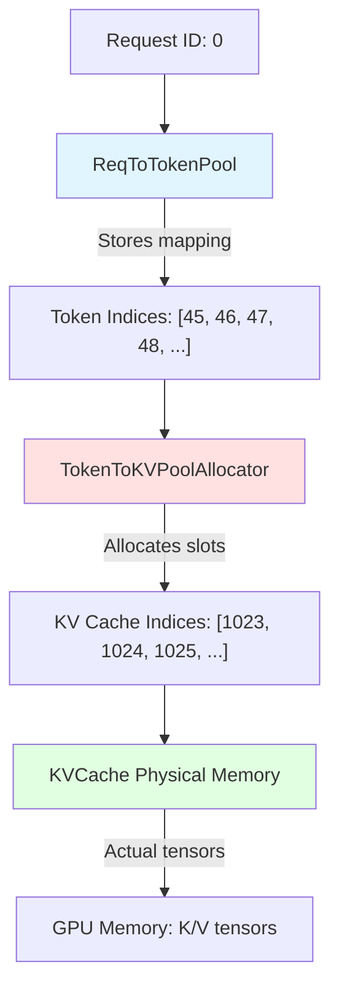

# Memory Pool Architecture: ReqToTokenPool vs TokenToKVPoolAllocator

## Quick Answer

**ReqToTokenPool** and **TokenToKVPoolAllocator** are two levels of indirection in SGLang's memory management system:

```
ReqToTokenPool: Maps requests to token positions (logical → logical)
    ↓
TokenToKVPoolAllocator: Maps token positions to KV cache slots (logical → physical)
    ↓
KVCache: Actual GPU memory holding key/value tensors (physical storage)
```

## The Two-Level Memory Architecture



## Level 1: ReqToTokenPool

**Purpose:** Maps each **request** to its **token positions**

**Location:** [python/sglang/srt/mem_cache/memory_pool.py:75-123](../../python/sglang/srt/mem_cache/memory_pool.py#L75-L123)

### Data Structure

```python
class ReqToTokenPool:
    """Maps a request to its token locations."""

    def __init__(self, size: int, max_context_len: int, device: str):
        # 2D tensor: [num_requests, max_context_len]
        # Each row stores token indices for one request
        self.req_to_token = torch.zeros(
            (size, max_context_len),
            dtype=torch.int32,
            device=device
        )

        # Available request slots
        self.free_slots = list(range(size))  # [0, 1, 2, ..., size-1]
```

### What It Stores

```python
# Example with 3 requests
req_to_token = [
    [45, 46, 47, 48, 49, 0, 0, 0, ...],  # Request 0: 5 tokens at positions 45-49
    [101, 102, 103, 104, 0, 0, 0, ...],  # Request 1: 4 tokens at positions 101-104
    [200, 201, 202, 0, 0, 0, 0, ...],    # Request 2: 3 tokens at positions 200-202
    # ... rest are empty
]
```

### Operations

```python
# Allocate a request slot
req_pool_idx = req_to_token_pool.alloc(need_size=1)  # Returns [0]

# Store token indices for request 0
req_to_token_pool.write(
    indices=0,
    values=[45, 46, 47, 48, 49]  # These are indices into TokenToKVPool
)

# Access token indices for request 0
token_indices = req_to_token_pool.req_to_token[0]  # [45, 46, 47, 48, 49, 0, ...]

# Free request slot
req_to_token_pool.free(0)  # Request 0 is done
```

### Key Responsibilities

1. ✅ Track which request occupies which slot
2. ✅ Store the sequence of token positions for each request
3. ✅ Enable reuse of request slots after completion
4. ❌ Does NOT allocate actual KV cache memory
5. ❌ Does NOT manage physical memory

## Level 2: TokenToKVPoolAllocator

**Purpose:** Allocates **KV cache slots** for tokens and manages the physical memory pool

**Location:** [python/sglang/srt/mem_cache/allocator.py:118-173](../../python/sglang/srt/mem_cache/allocator.py#L118-L173)

### Data Structure

```python
class TokenToKVPoolAllocator:
    """An allocator managing the indices to kv cache data."""

    def __init__(self, size: int, dtype: torch.dtype, device: str, kvcache: KVCache):
        self.size = size  # Total number of token slots
        self.kvcache = kvcache  # Reference to actual KV tensors

        # Available KV cache indices (1D array of free slots)
        # Slot 0 is reserved for padding, so start from 1
        self.free_pages = torch.arange(
            1, size + 1,
            dtype=torch.int64,
            device=device
        )  # [1, 2, 3, ..., size]

        self.release_pages = torch.empty((0,), dtype=torch.int64, device=device)
```

### What It Stores

```python
# Initial state: all slots free
free_pages = [1, 2, 3, 4, 5, ..., 100000]

# After allocating 5 slots for request 0
free_pages = [6, 7, 8, 9, 10, ..., 100000]
# Allocated: [1, 2, 3, 4, 5] -> These become token indices in ReqToTokenPool

# After allocating 4 slots for request 1
free_pages = [10, 11, 12, 13, ..., 100000]
# Allocated: [6, 7, 8, 9]
```

### Operations

```python
# Allocate KV cache slots
allocated_indices = token_to_kv_pool.alloc(need_size=5)
# Returns: tensor([1, 2, 3, 4, 5])
# These indices point to positions in the actual KV cache tensors

# Free slots when request completes
token_to_kv_pool.free(torch.tensor([1, 2, 3, 4, 5]))
# Adds [1, 2, 3, 4, 5] back to free_pages

# Check available memory
available = token_to_kv_pool.available_size()  # Number of free slots
```

### Key Responsibilities

1. ✅ Allocate physical KV cache slots
2. ✅ Track which slots are free vs occupied
3. ✅ Manage fragmentation (sorting free slots if needed)
4. ✅ Provide access to the actual KVCache object
5. ❌ Does NOT know about requests (just manages a pool of indices)

## Level 3: KVCache

**Purpose:** Actual **GPU memory** holding key and value tensors

**Location:** [python/sglang/srt/mem_cache/memory_pool.py:428+](../../python/sglang/srt/mem_cache/memory_pool.py#L428)

### Data Structure

```python
class KVCache:
    """Physical storage for key/value tensors."""

    def __init__(self, size: int, dtype: torch.dtype, layer_num: int, ...):
        # Actual KV cache tensors
        # Shape: [num_layers, size, num_heads, head_dim]
        self.k_buffer = [
            torch.empty(
                (size, num_heads, head_dim),
                dtype=dtype,
                device=device
            )
            for _ in range(layer_num)
        ]

        self.v_buffer = [
            torch.empty(
                (size, num_heads, head_dim),
                dtype=dtype,
                device=device
            )
            for _ in range(layer_num)
        ]
```

### What It Stores

```python
# For a Llama-7B model:
# - num_layers = 32
# - num_heads = 32
# - head_dim = 128
# - size = 100000 tokens

# Memory layout for layer 0:
k_buffer[0] = Tensor[100000, 32, 128]  # ~1.6 GB (fp16)
v_buffer[0] = Tensor[100000, 32, 128]  # ~1.6 GB (fp16)

# Total: 32 layers × 2 (K+V) × 1.6 GB = ~103 GB
```

## Complete Example: Request Lifecycle

### Step 1: New Request Arrives

```python
# User request: "What is the capital of France?"
prompt = "What is the capital of France?"
input_ids = [1, 1841, 338, 278, 7483, 310, 3444]  # 7 tokens
```

### Step 2: Allocate Request Slot (ReqToTokenPool)

```python
# Allocate a slot in ReqToTokenPool
req_pool_idx = req_to_token_pool.alloc(need_size=1)
# Returns: [0] (first available request slot)

# Now req_pool_idx = 0 represents this request
```

**State:**
```python
req_to_token_pool.req_to_token:
    [
        [0, 0, 0, 0, 0, 0, 0, ...],  # Request 0: empty (just allocated)
        [0, 0, 0, 0, 0, 0, 0, ...],  # Request 1: not allocated
        ...
    ]

req_to_token_pool.free_slots: [1, 2, 3, ...]  # Slot 0 now used
```

### Step 3: Allocate KV Cache Slots (TokenToKVPoolAllocator)

```python
# Allocate KV cache slots for 7 input tokens
kv_indices = token_to_kv_pool.alloc(need_size=7)
# Returns: tensor([1, 2, 3, 4, 5, 6, 7])
```

**State:**
```python
token_to_kv_pool.free_pages: [8, 9, 10, 11, ...]  # First 7 slots now used
```

### Step 4: Map Request to Tokens (ReqToTokenPool)

```python
# Store mapping: request 0 → KV indices [1, 2, 3, 4, 5, 6, 7]
req_to_token_pool.write(
    indices=0,
    values=kv_indices  # [1, 2, 3, 4, 5, 6, 7]
)
```

**State:**
```python
req_to_token_pool.req_to_token:
    [
        [1, 2, 3, 4, 5, 6, 7, 0, 0, ...],  # Request 0: mapped to KV slots 1-7
        [0, 0, 0, 0, 0, 0, 0, ...],
        ...
    ]
```

### Step 5: Prefill - Write KV Cache (KVCache)

```python
# During model forward pass, for each layer:
for layer in range(num_layers):
    # Compute keys and values
    keys, values = model.compute_kv(input_ids, layer)
    # Shape: [7, num_heads, head_dim]

    # Write to KV cache at allocated positions
    kvcache.k_buffer[layer][kv_indices] = keys
    kvcache.v_buffer[layer][kv_indices] = values
```

**State (Layer 0):**
```python
kvcache.k_buffer[0]:
    [
        [0, 0, ..., 0],           # Slot 0: padding (unused)
        [k_0 for "What"],         # Slot 1: key for token "What"
        [k_1 for "is"],           # Slot 2: key for token "is"
        [k_2 for "the"],          # Slot 3: key for token "the"
        [k_3 for "capital"],      # Slot 4: key for token "capital"
        [k_4 for "of"],           # Slot 5: key for token "of"
        [k_5 for "France"],       # Slot 6: key for token "France"
        [k_6 for "?"],            # Slot 7: key for token "?"
        [0, 0, ..., 0],           # Slot 8+: not yet used
        ...
    ]
```

### Step 6: Decode - Generate First Token

```python
# Allocate one more slot for the generated token
new_kv_idx = token_to_kv_pool.alloc(need_size=1)
# Returns: tensor([8])

# Append to request's token sequence
current_tokens = req_to_token_pool.req_to_token[0][:7]  # [1,2,3,4,5,6,7]
updated_tokens = torch.cat([current_tokens, new_kv_idx])  # [1,2,3,4,5,6,7,8]
req_to_token_pool.write(indices=0, values=updated_tokens)

# Compute and store KV for new token
for layer in range(num_layers):
    new_k, new_v = model.compute_kv(new_token_id, layer)
    kvcache.k_buffer[layer][8] = new_k  # Write to slot 8
    kvcache.v_buffer[layer][8] = new_v
```

**State:**
```python
req_to_token_pool.req_to_token[0]: [1, 2, 3, 4, 5, 6, 7, 8, 0, ...]
token_to_kv_pool.free_pages: [9, 10, 11, ...]
kvcache.k_buffer[0][8]: [k_7 for "Paris"]  # Generated token
```

### Step 7: Request Completion - Cleanup

```python
# Request finished, free all resources
token_indices = req_to_token_pool.req_to_token[0][:8]  # [1,2,3,4,5,6,7,8]

# Free KV cache slots
token_to_kv_pool.free(token_indices)

# Free request slot
req_to_token_pool.free(0)
```

**Final State:**
```python
req_to_token_pool.free_slots: [0, 1, 2, ...]  # Slot 0 available again
token_to_kv_pool.free_pages: [9, 10, 11, ..., 1, 2, 3, 4, 5, 6, 7, 8]  # Slots 1-8 freed
# KV cache memory still contains old data, but marked as free and will be overwritten
```

## Memory Hierarchy Visualization

```
┌─────────────────────────────────────────────────────────────┐
│                    REQUEST LEVEL                             │
│  ReqToTokenPool: "Which request owns which tokens?"         │
│  ┌───────────────────────────────────────────────────────┐  │
│  │ Request 0 → [1, 2, 3, 4, 5, 6, 7, 8]                  │  │
│  │ Request 1 → [9, 10, 11, 12]                           │  │
│  │ Request 2 → [13, 14, 15, 16, 17]                      │  │
│  └───────────────────────────────────────────────────────┘  │
└──────────────────────┬──────────────────────────────────────┘
                       │ Indices into ↓
┌──────────────────────┴──────────────────────────────────────┐
│                    TOKEN LEVEL                               │
│  TokenToKVPoolAllocator: "Which KV slots are free?"         │
│  ┌───────────────────────────────────────────────────────┐  │
│  │ Allocated: [1-17]                                     │  │
│  │ Free:      [18, 19, 20, 21, ...]                      │  │
│  └───────────────────────────────────────────────────────┘  │
└──────────────────────┬──────────────────────────────────────┘
                       │ Indices into ↓
┌──────────────────────┴──────────────────────────────────────┐
│                  PHYSICAL MEMORY                             │
│  KVCache: "Actual key/value tensors"                        │
│  ┌───────────────────────────────────────────────────────┐  │
│  │ Layer 0:                                              │  │
│  │   k_buffer[0]: [pad, k₁, k₂, k₃, ..., k₁₇, 0, 0, ...] │  │
│  │   v_buffer[0]: [pad, v₁, v₂, v₃, ..., v₁₇, 0, 0, ...] │  │
│  │ Layer 1:                                              │  │
│  │   k_buffer[1]: [pad, k₁, k₂, k₃, ..., k₁₇, 0, 0, ...] │  │
│  │   v_buffer[1]: [pad, v₁, v₂, v₃, ..., v₁₇, 0, 0, ...] │  │
│  │ ...                                                   │  │
│  └───────────────────────────────────────────────────────┘  │
└─────────────────────────────────────────────────────────────┘
```

## Why Two Levels?

### Reason 1: Separation of Concerns

```python
# Request-level operations (scheduler's responsibility)
"How many requests can we fit?"
"Which requests are done?"
"What's the sequence length of request 5?"

# Memory-level operations (allocator's responsibility)
"Do we have 100 free slots?"
"Allocate 50 contiguous slots"
"Free slots [45-67]"
```

### Reason 2: Efficient Batching

```python
# Requests have different lengths
Request 0: 7 tokens  → needs slots [1, 2, 3, 4, 5, 6, 7]
Request 1: 4 tokens  → needs slots [8, 9, 10, 11]
Request 2: 10 tokens → needs slots [12, 13, ..., 21]

# But all share the same KV cache pool
# Allocator doesn't care which request owns which tokens
# It just manages a pool of free slots
```

### Reason 3: Prefix Caching

```python
# Multiple requests can share common prefix tokens
Request 0: "Translate to French: Hello world"  → [1, 2, 3, 4, 5, 6, 7]
Request 1: "Translate to French: Good morning" → [1, 2, 3, 4, 8, 9, 10]
                          ↑
# Both requests share tokens 1-4 ("Translate to French:")
# ReqToTokenPool allows this sharing via duplicate indices
# TokenToKVPoolAllocator just sees tokens 1-4 as allocated (reference counted)
```

## Paged Allocation Variant

SGLang also supports **paged allocation** for better memory efficiency:

```python
class PagedTokenToKVPoolAllocator(BaseTokenToKVPoolAllocator):
    """Allocates in page-aligned chunks instead of individual tokens."""

    def __init__(self, size: int, page_size: int, ...):
        self.page_size = page_size  # e.g., 16 tokens per page
        self.num_pages = size // page_size

        # Free pages instead of free tokens
        self.free_pages = torch.arange(1, self.num_pages + 1, ...)
```

**Difference:**
- **TokenToKVPoolAllocator**: Allocates individual tokens
- **PagedTokenToKVPoolAllocator**: Allocates 16-token pages (reduces fragmentation)

## Summary Table

| Component | Level | Manages | Data Structure | Size |
|-----------|-------|---------|----------------|------|
| **ReqToTokenPool** | Request | Request → Token mapping | 2D tensor [num_reqs, max_len] | `size × max_context_len × 4 bytes` |
| **TokenToKVPoolAllocator** | Token | Free KV slots | 1D tensor [num_free_slots] | `size × 8 bytes` |
| **KVCache** | Physical | K/V tensors | List of tensors [layers][tokens, heads, dim] | `num_layers × size × num_heads × head_dim × dtype_bytes` |

## Access Pattern

```python
# To get KV cache for request 0 at layer 5:

# Step 1: Get token indices from ReqToTokenPool
token_indices = req_to_token_pool.req_to_token[0]  # [1, 2, 3, 4, 5, 6, 7, 8]

# Step 2: Use indices to access KVCache directly
# (TokenToKVPoolAllocator already allocated these, no lookup needed)
keys = kvcache.k_buffer[5][token_indices]    # Get keys at layer 5
values = kvcache.v_buffer[5][token_indices]  # Get values at layer 5

# Result:
# keys: [8, num_heads, head_dim]
# values: [8, num_heads, head_dim]
```

## Key Takeaways

1. **ReqToTokenPool** is the **logical layer** - maps requests to their token positions
2. **TokenToKVPoolAllocator** is the **allocation layer** - manages which slots are free/used
3. **KVCache** is the **physical layer** - actual GPU tensors storing K/V data
4. The **indices** from TokenToKVPoolAllocator **are** the indices into KVCache
5. This two-level design enables **efficient memory reuse**, **prefix caching**, and **clean separation of concerns**

## Related Files

- [memory_pool.py](../../python/sglang/srt/mem_cache/memory_pool.py) - ReqToTokenPool and KVCache
- [allocator.py](../../python/sglang/srt/mem_cache/allocator.py) - TokenToKVPoolAllocator variants
- [schedule_batch.py](../../python/sglang/srt/managers/schedule_batch.py) - Uses both pools
- [model_runner.py](../../python/sglang/srt/model_executor/model_runner.py) - Creates these pools
