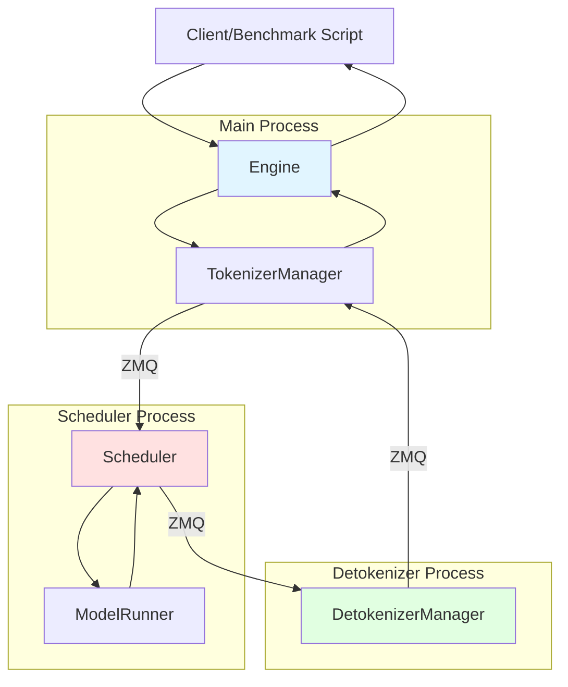

# SGLang Benchmark Execution Flow Documentation

This directory contains comprehensive documentation on the execution flow and data transformations in SGLang's benchmark scripts.

## Overview

SGLang provides four primary benchmark scripts in [`python/sglang/`](../../python/sglang/):

1. **[bench_offline_throughput.py](01_bench_offline_throughput.md)** - Offline mode throughput testing
2. **[bench_serving.py](02_bench_serving.md)** - Online serving with dynamic request arrival
3. **[bench_one_batch.py](03_bench_one_batch.md)** - Low-level single batch latency (no server)
4. **[bench_one_batch_server.py](04_bench_one_batch_server.md)** - Single batch latency with HTTP server

## Execution Modes

SGLang supports two primary execution modes:

### Offline Mode
- Direct API calls to `Engine` or `Runtime`
- No HTTP server involved
- All requests submitted at once
- Used for: throughput benchmarking, batch processing

### Server Mode
- HTTP/gRPC server receives requests
- Asynchronous request handling
- Streaming support
- Used for: online serving, production deployments

## Architecture Components



### Key Components

1. **[Engine](../../python/sglang/srt/entrypoints/engine.py)** - Entry point for offline inference
2. **[Runtime](../../python/sglang/lang/backend/runtime_endpoint.py)** - HTTP client wrapper for server mode
3. **[TokenizerManager](../../python/sglang/srt/managers/tokenizer_manager.py)** - Tokenizes inputs and manages request lifecycle
4. **[Scheduler](../../python/sglang/srt/managers/scheduler.py)** - Batches requests and schedules execution
5. **[ModelRunner](../../python/sglang/srt/model_executor/model_runner.py)** - Executes model forward passes
6. **[DetokenizerManager](../../python/sglang/srt/managers/detokenizer_manager.py)** - Converts tokens to text

## Inter-Process Communication

SGLang uses **ZMQ (ZeroMQ)** for IPC between processes:

```
TokenizerManager  <--[ZMQ DEALER/ROUTER]-->  Scheduler
Scheduler         <--[ZMQ DEALER/ROUTER]-->  DetokenizerManager
```

## Documentation Structure

Each benchmark has a dedicated markdown file with:

1. **Purpose and Usage** - What the benchmark measures
2. **Execution Flow Diagram** - Mermaid diagram showing the complete flow
3. **Code Walkthrough** - Step-by-step annotated code explanation
4. **Data Transformations** - Input/output at each stage with types and shapes
5. **Key Files** - Links to relevant source files

## Quick Reference

| Benchmark | Mode | Process Model | Measures |
|-----------|------|---------------|----------|
| bench_offline_throughput | Offline | Multi-process | Max throughput |
| bench_serving | Server | Multi-process + HTTP | Request latency, TTFT, throughput |
| bench_one_batch | Offline | Multi-process | Single batch latency |
| bench_one_batch_server | Server | Multi-process + HTTP | Single batch latency via HTTP |

## Getting Started

1. Start with [bench_offline_throughput.md](01_bench_offline_throughput.md) for the simplest offline flow
2. Read [bench_one_batch.md](03_bench_one_batch.md) to understand low-level execution
3. Study [bench_serving.md](02_bench_serving.md) for production-like serving patterns

## Related Documentation

- [ARCHITECTURE.md](../../ARCHITECTURE.md) - Overall SGLang architecture
- [Server Args](../../python/sglang/srt/server_args.py) - Configuration options
- [IO Structs](../../python/sglang/srt/managers/io_struct.py) - Request/response formats
